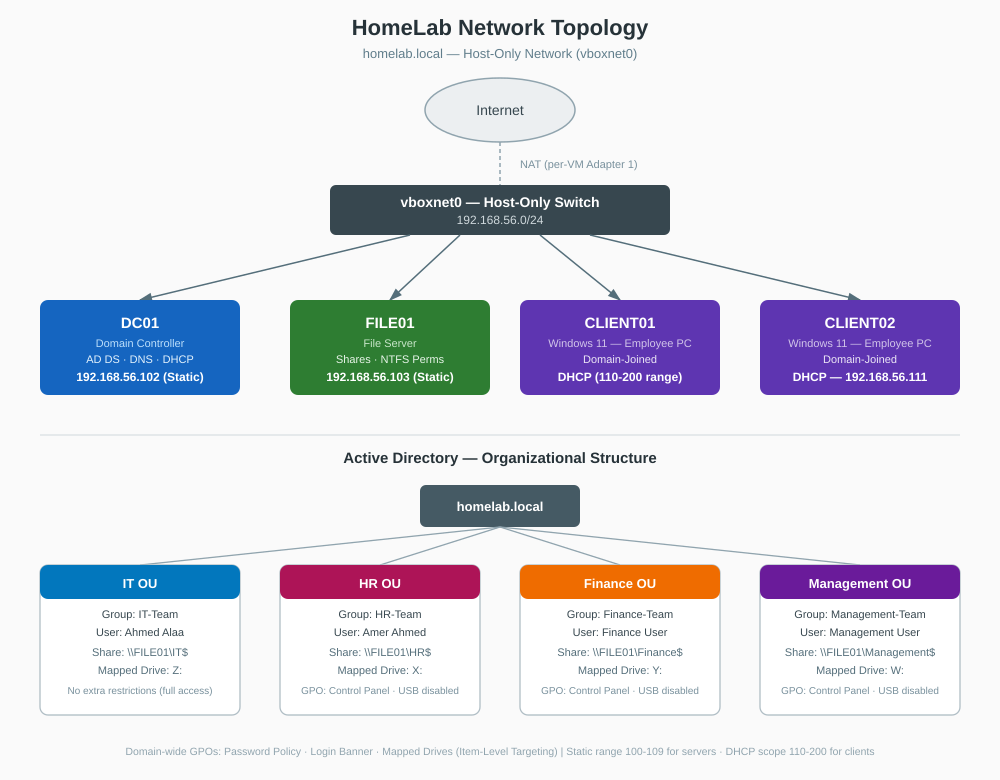

# 11 - Network Topology Diagram

## Goal
Provide a single visual reference for the lab's network layout and Active Directory structure, tying together every VM, IP address, share, and GPO built across the previous phases.

## Diagram

## Summary

**Network layer:** All four VMs sit on the `vboxnet0` Host-Only network (192.168.56.0/24). DC01 and FILE01 use static IPs (100-109 range, reserved for servers); CLIENT01 and CLIENT02 receive dynamic IPs from the DHCP scope (110-200 range). Each VM also has a separate NAT adapter for internet access, kept isolated from the domain network.

**AD layer:** Four Organizational Units (IT, HR, Finance, Management) each contain a dedicated security group and user. File access and mapped drives are scoped per department through NTFS/Share permissions and a single Mapped Drives GPO using Item-Level Targeting.

**GPOs:**
- Domain-wide: Password Policy, Login Banner, Mapped Drives (targeted per department)
- HR / Finance / Management: Disable Control Panel, USB storage disabled
- IT: no extra restrictions — full local access required for support work
