# 02 - Active Directory DS Install & Domain Controller Promotion

## Goal
Install the Active Directory Domain Services role on Windows Server 2022 and promote it to a Domain Controller.

## Steps
1. Open Server Manager → Add Roles and Features
2. Select Active Directory Domain Services
3. Complete installation
4. Click the notification flag → Promote this server to a Domain Controller
5. Select "Add a new forest" and set domain name: homelab.local
6. Set DSRM password
7. Complete wizard and let server restart
8. Verify AD DS is running after reboot
9. Verify DNS is configured correctly

## Verification
- Logged in with HOMELAB\Administrator
- Active Directory Users and Computers opens successfully
- DNS Manager shows homelab.local zone

## Screenshots

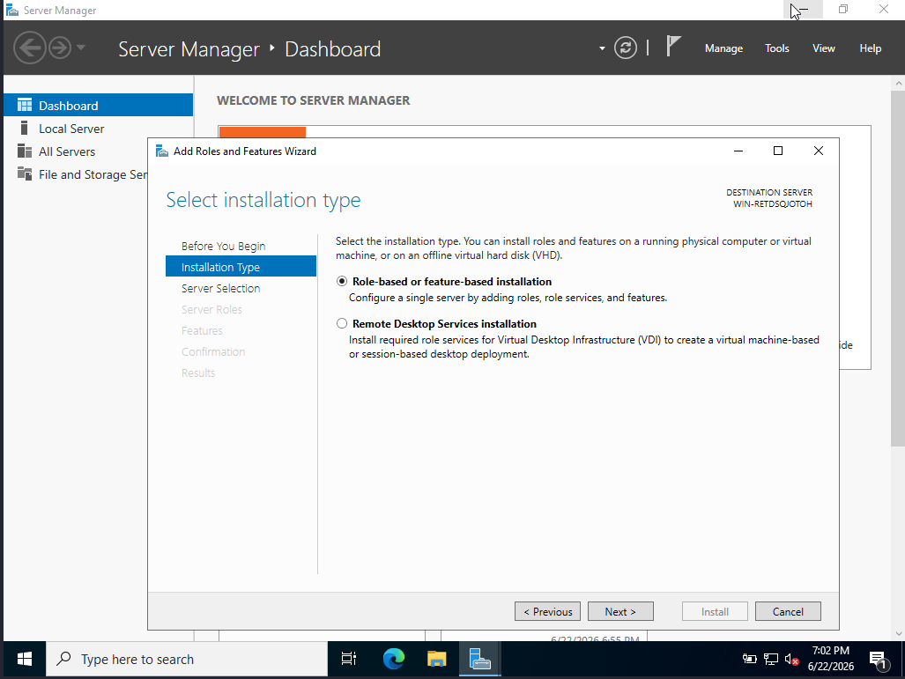
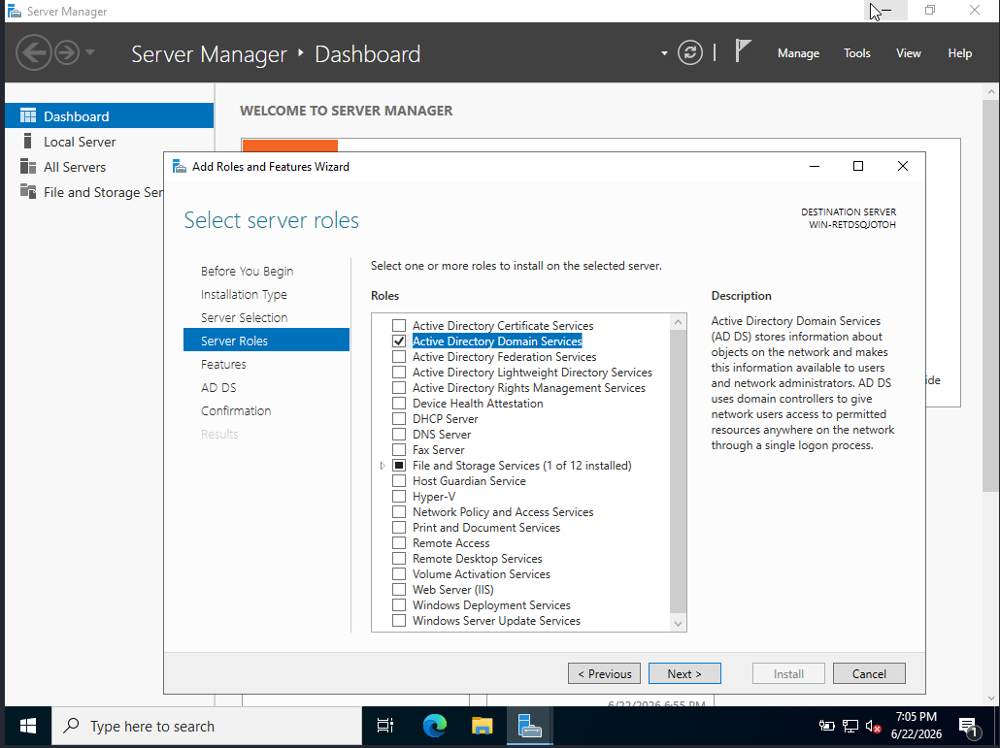
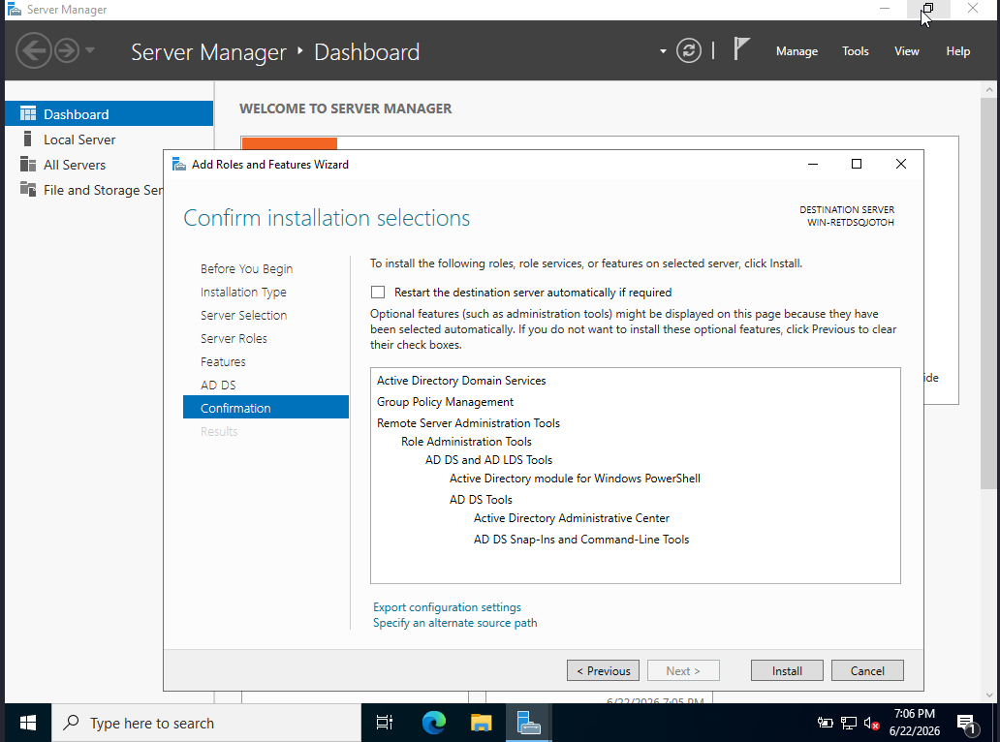
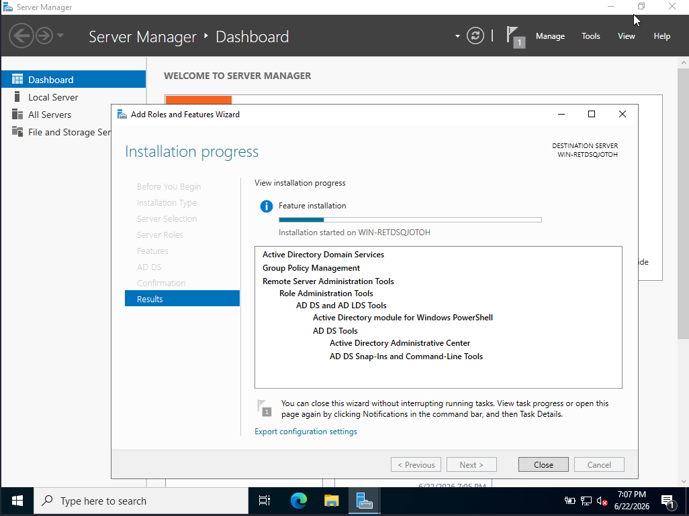
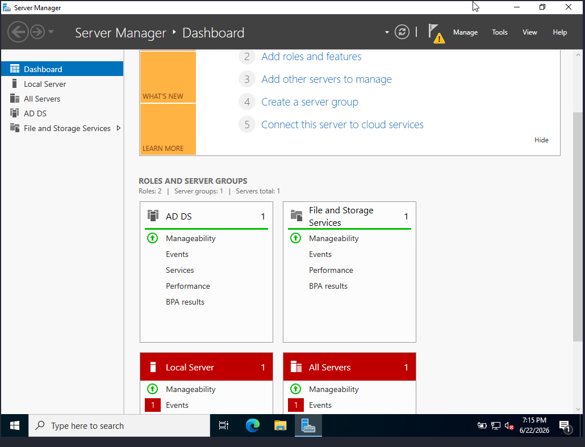
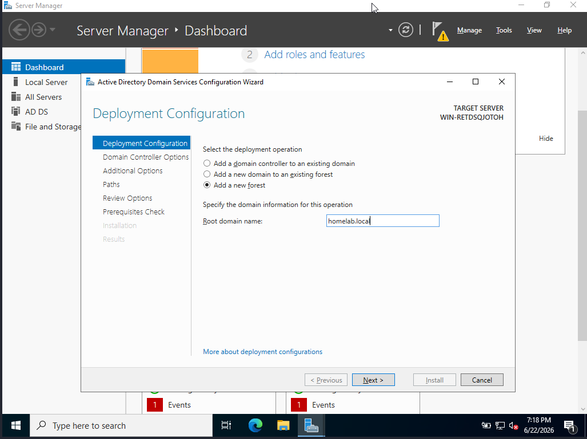
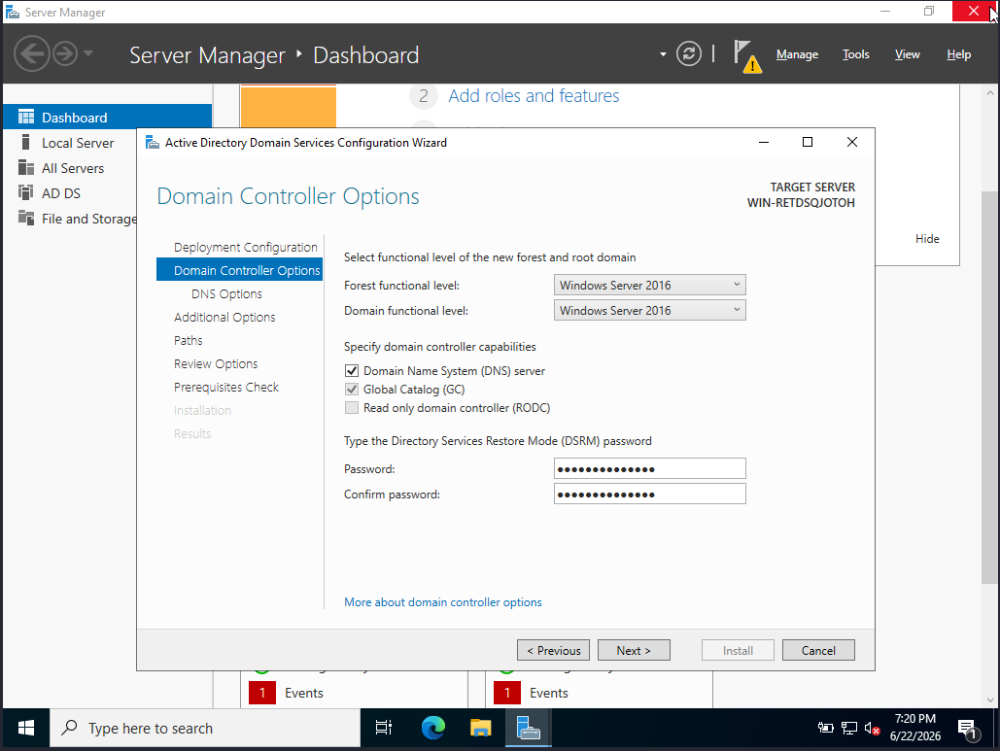
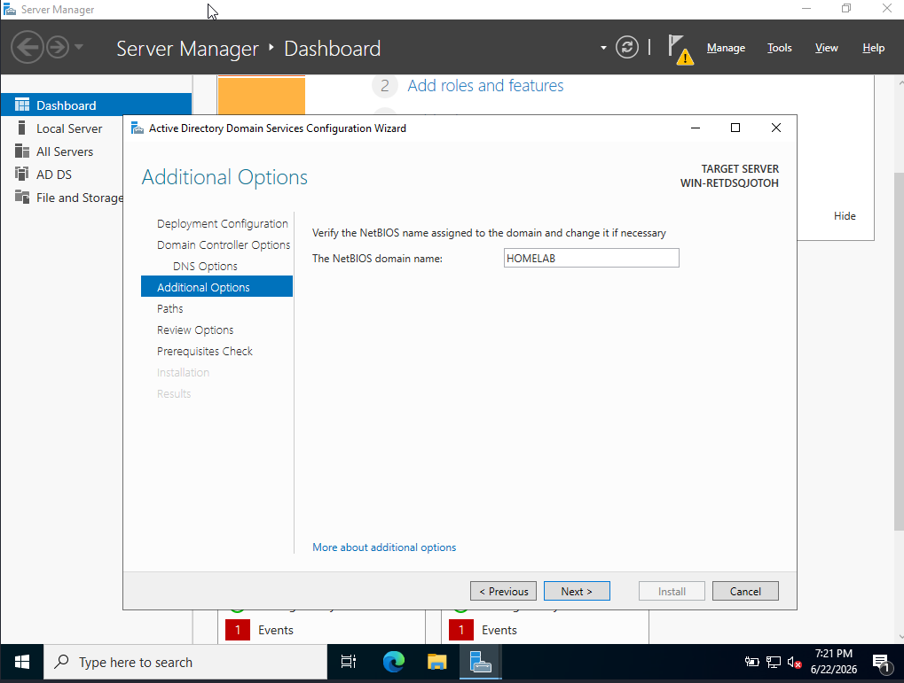
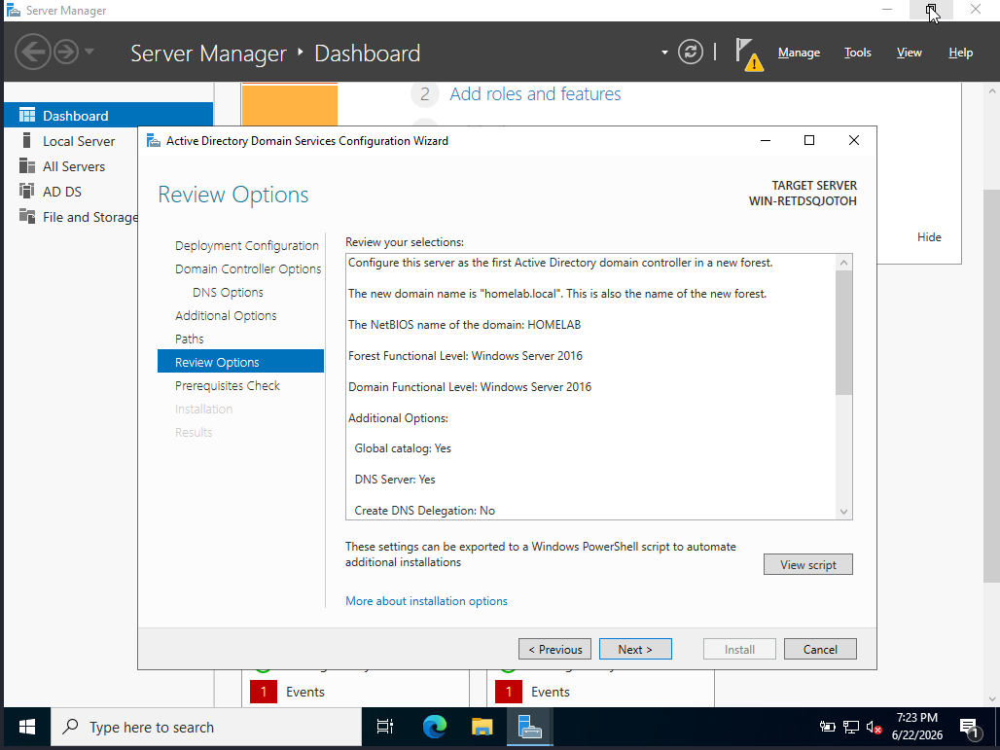
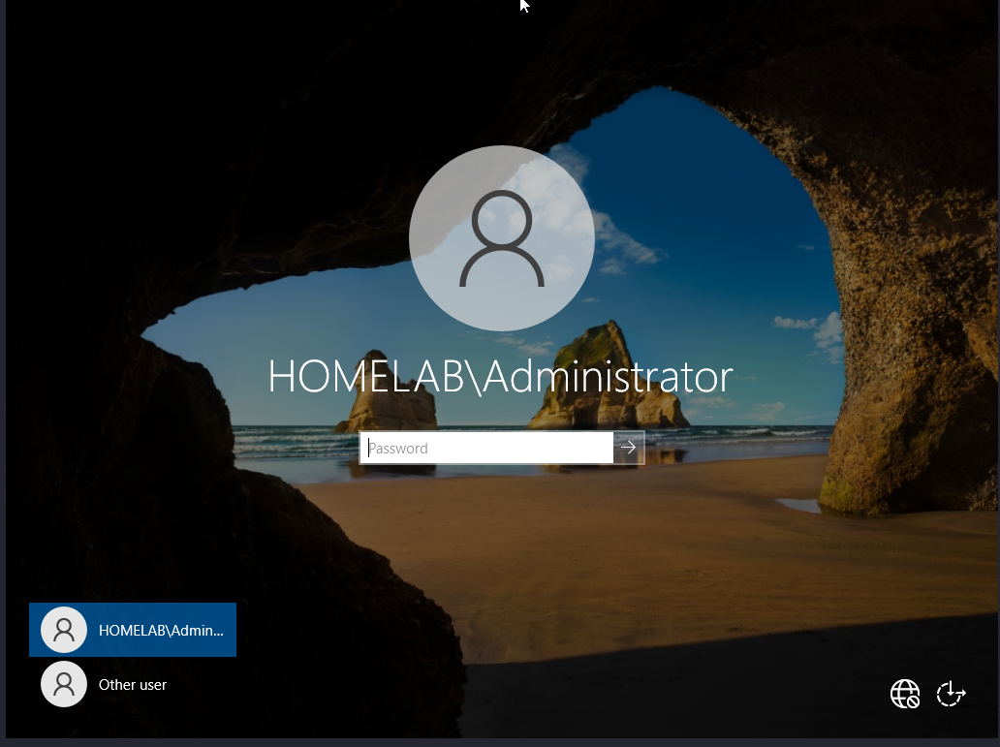
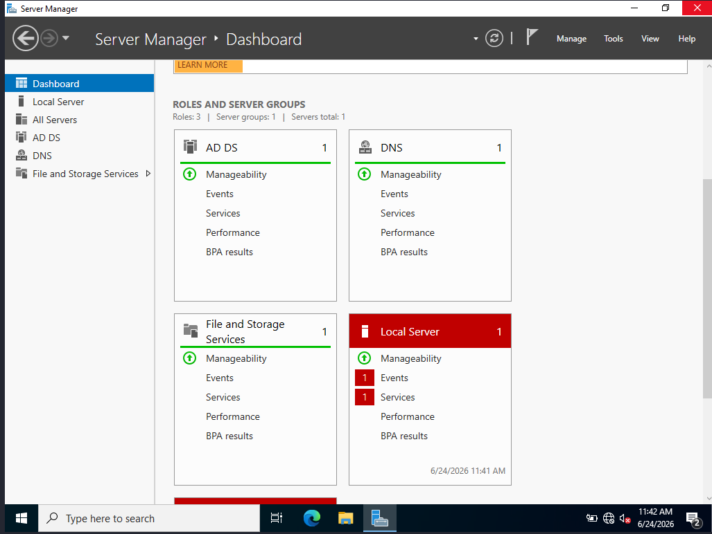
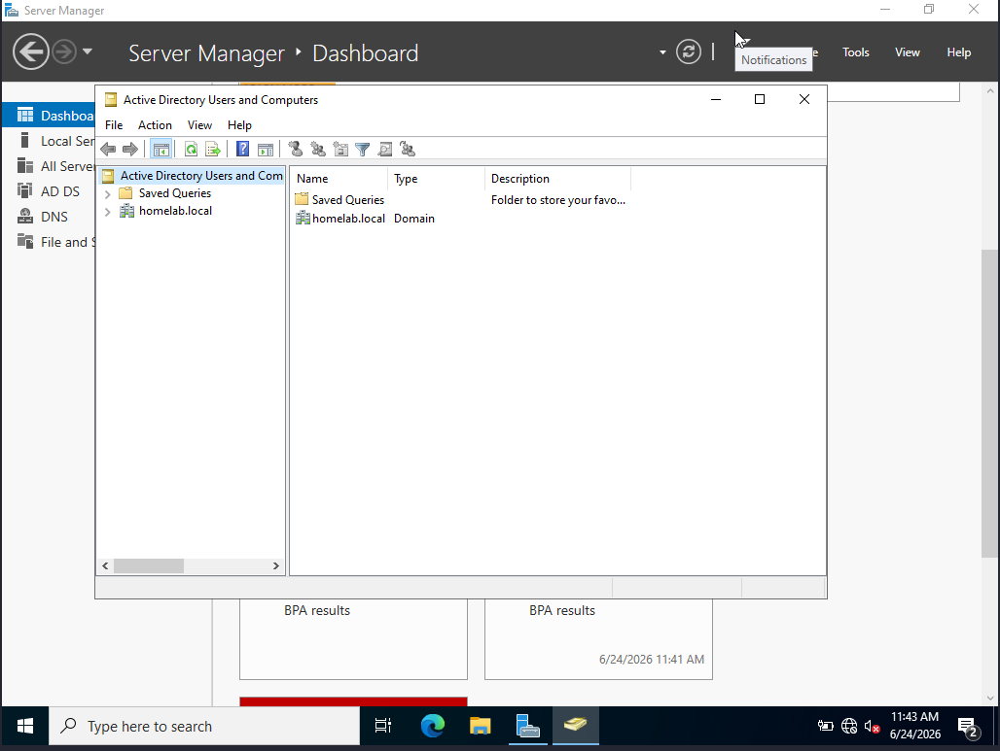
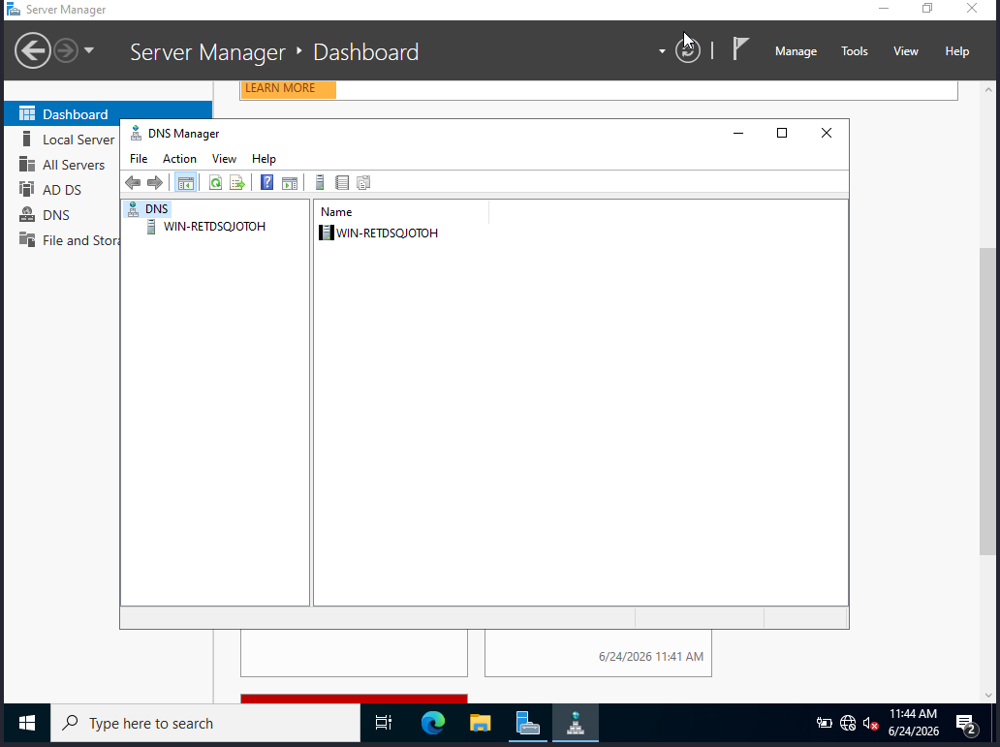
