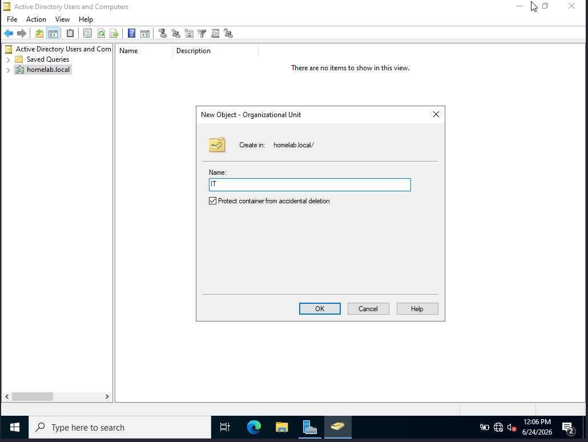
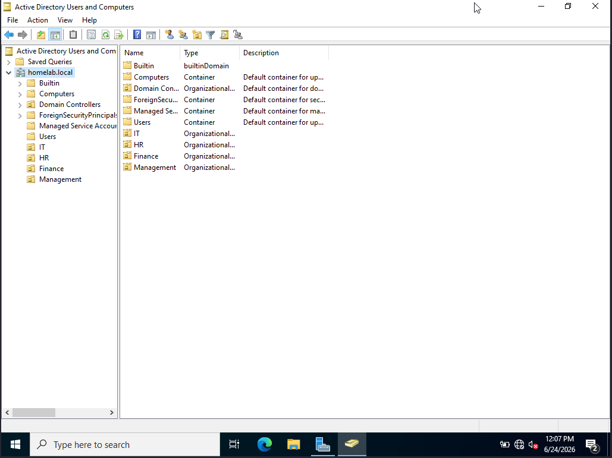
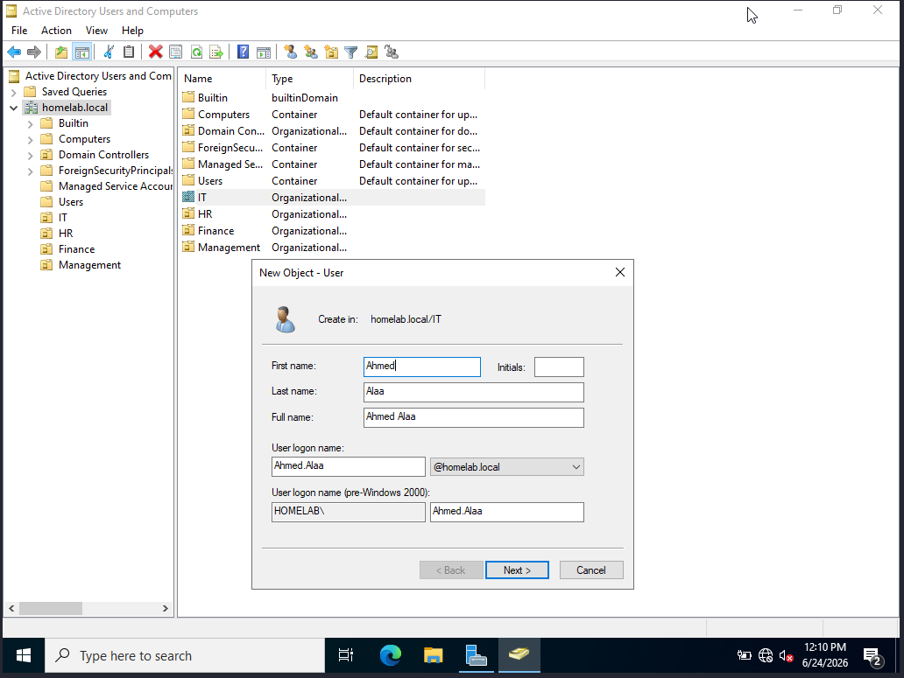
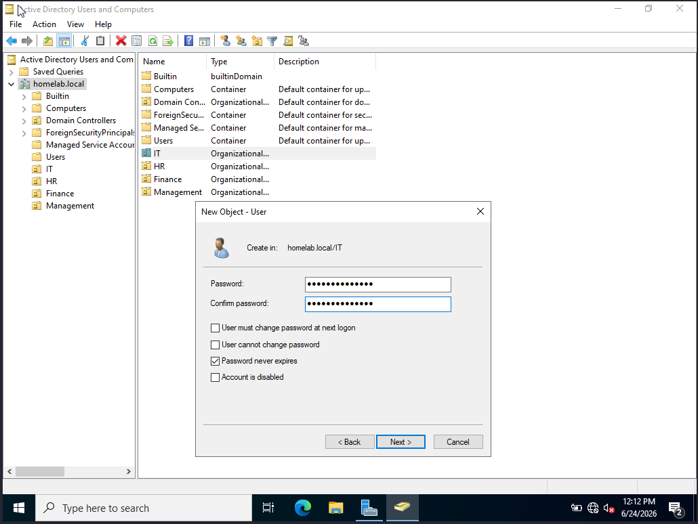
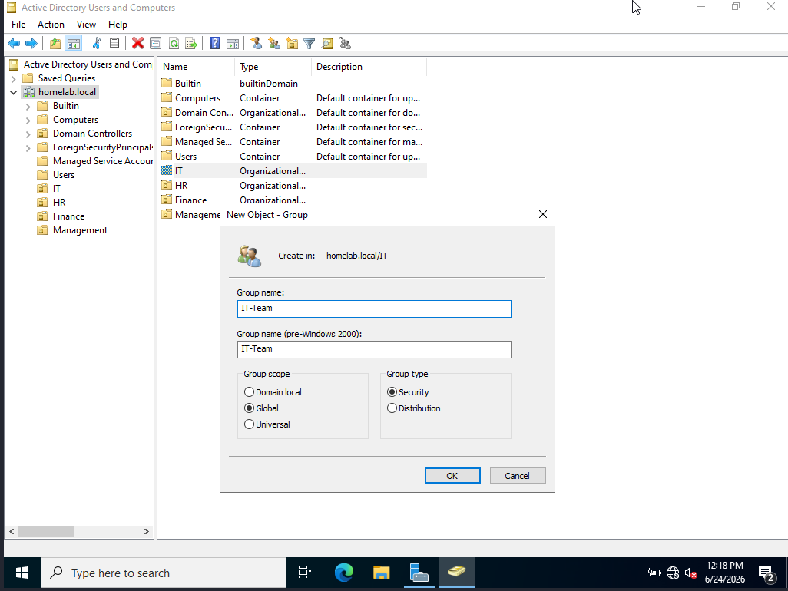
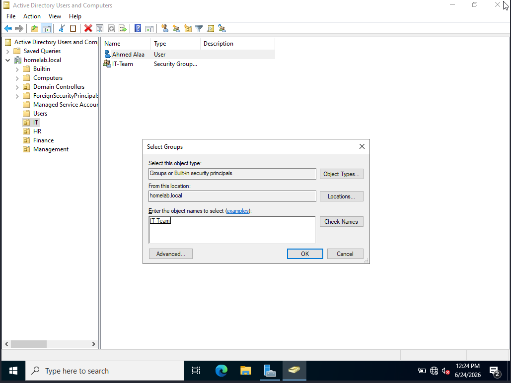

# 03 - Organizational Units, Users & Groups

## Goal
Create a structured Active Directory layout using OUs, then populate it with users and groups.

## OU Structure
homelab.local

├── IT

├── HR

├── Finance

└── Management

## Steps
1. Open Active Directory Users and Computers
2. Right click domain → New → Organizational Unit
3. Create OUs: IT, HR, Finance, Management
4. Create users inside each OU
5. Create security groups inside each OU
6. Add users to their respective groups

## Users Created
| Name | OU | Group |
|------|----|-------|
| Ahmed Alaa | IT | IT-Team |
| Amer Ahmed | HR | HR-Team |
| Finance User | Finance | Finance-Team |
| Management User | Management | Management-Team |

## Screenshots

