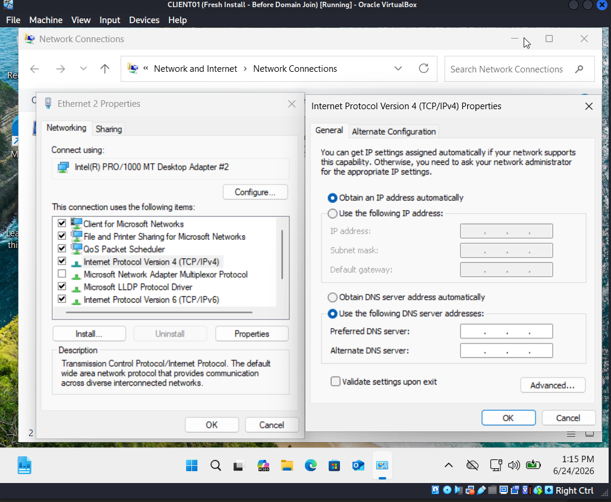
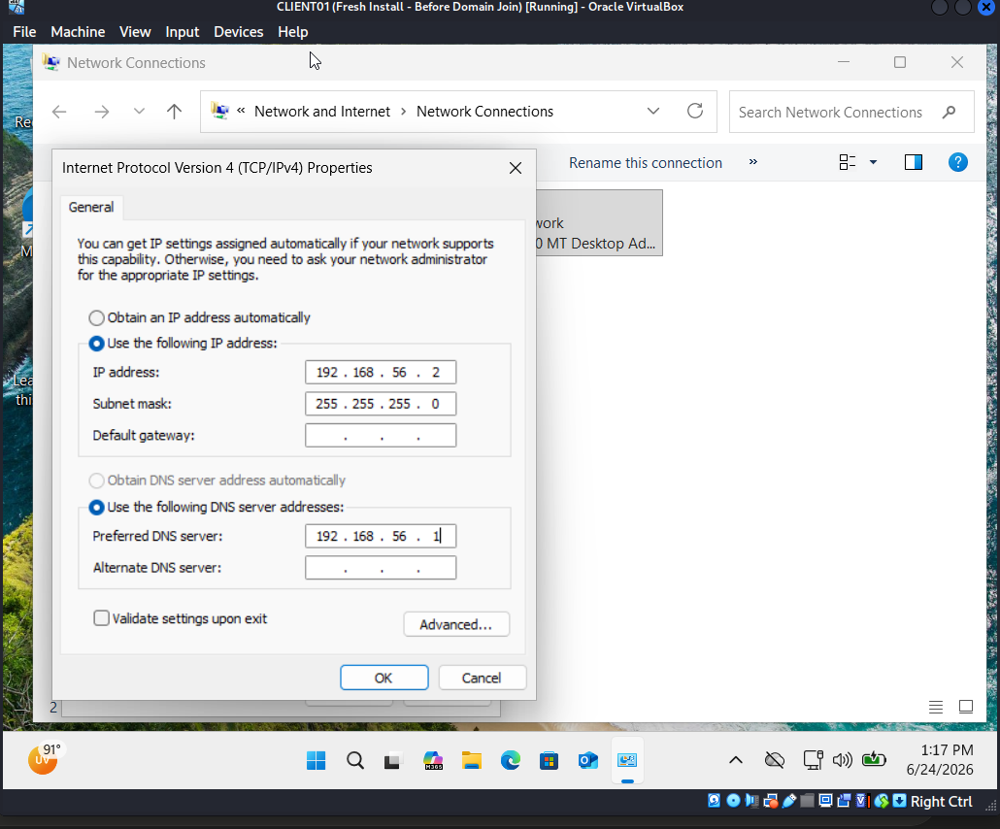
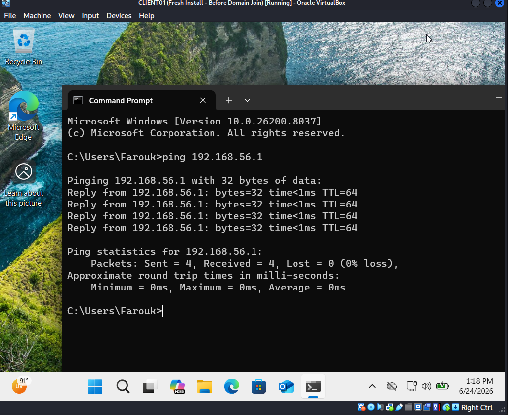
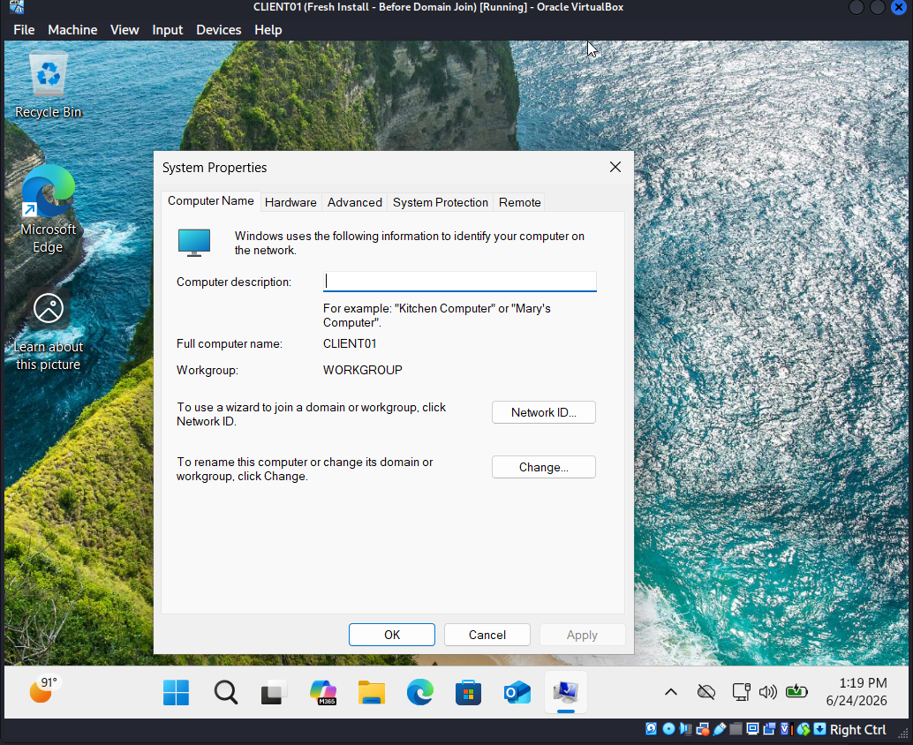
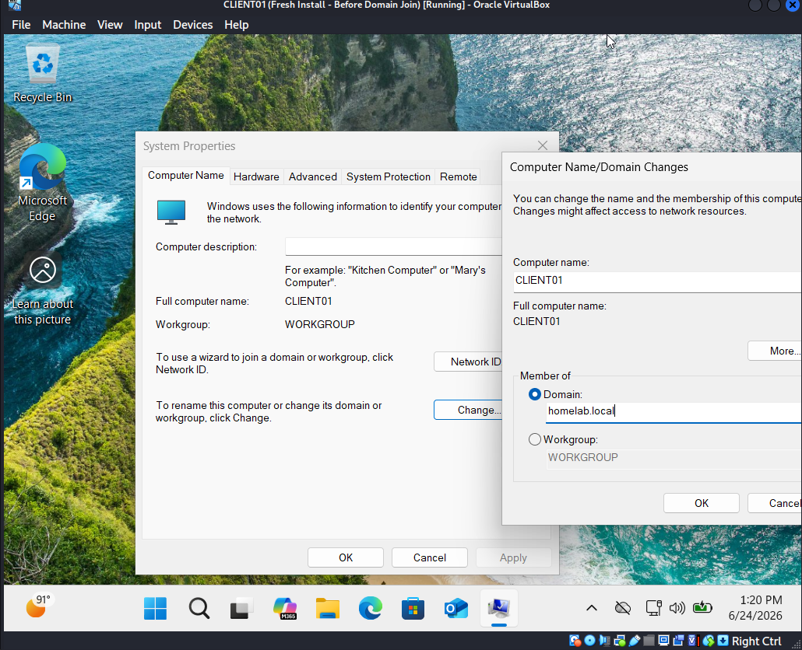
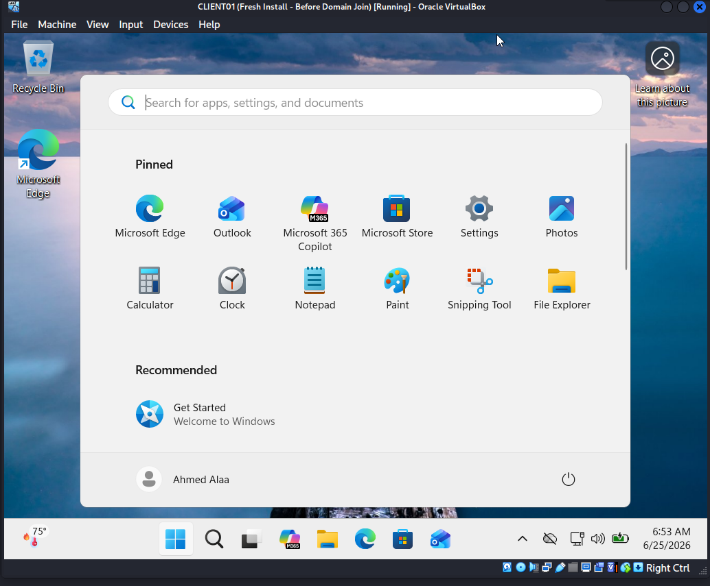
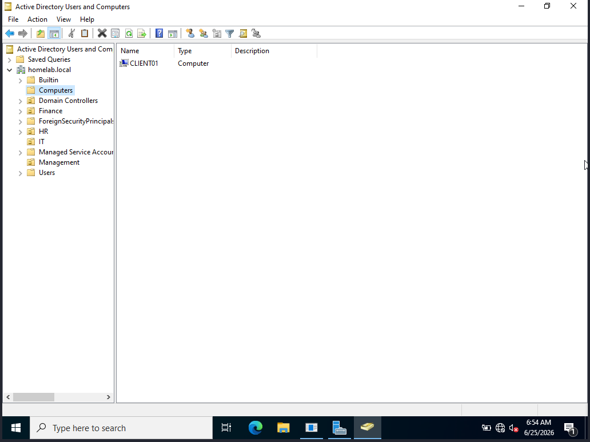

# 04 - Domain Joining Windows 11

## Goal
Join the Windows 11 client machine to the homelab.local domain and verify login with a domain user.

## Prerequisites
- Windows Server 2022 DC is running
- Both VMs are on the same Host-Only network
- Windows 11 VM DNS is pointed to DC's IP: 192.168.56.102

## Steps
1. On Windows 11 VM set DNS to 192.168.56.102
2. Open Settings → System → About → Domain or workgroup
3. Click Change → Select Domain → type homelab.local
4. Enter domain admin credentials when prompted
5. Restart the machine
6. Log in with a domain user account

## Verification
- Logged in as HOMELAB\Ahmed.Alaa successfully
- CLIENT01 appears in Active Directory Users and Computers under Computers
- Ran nltest /dsgetdc:homelab.local to confirm DC connection

## Screenshots

