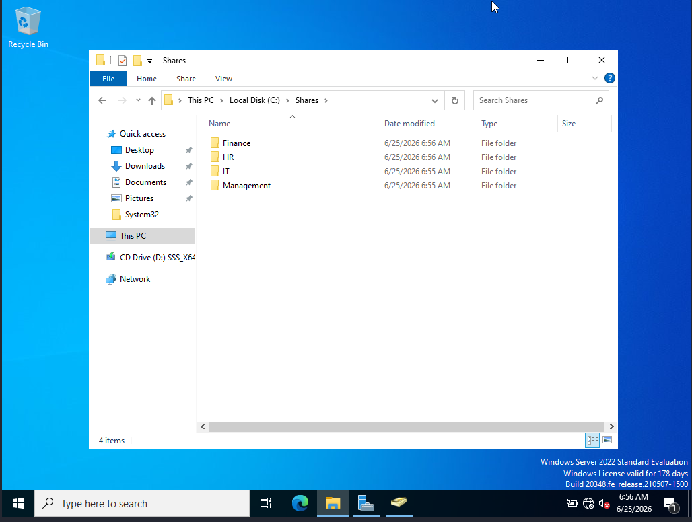
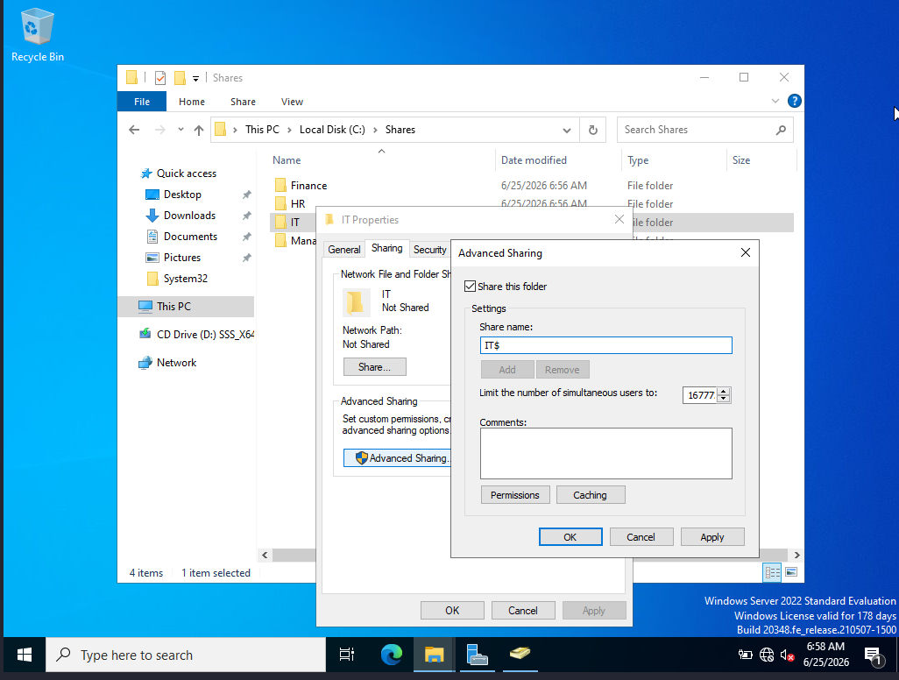
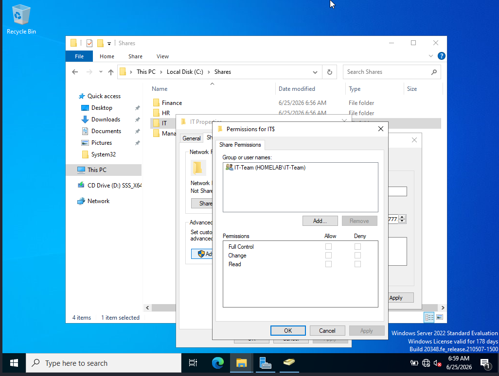
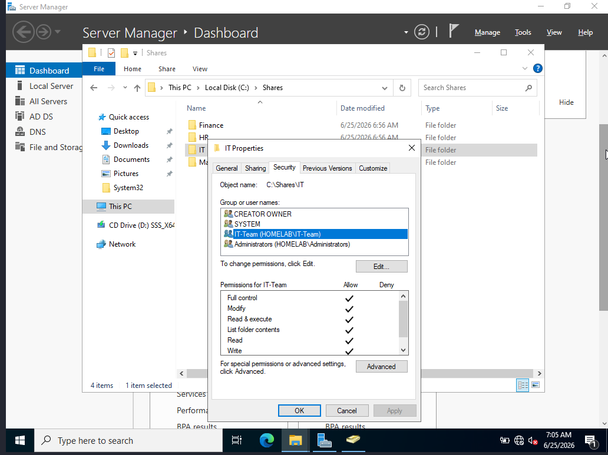
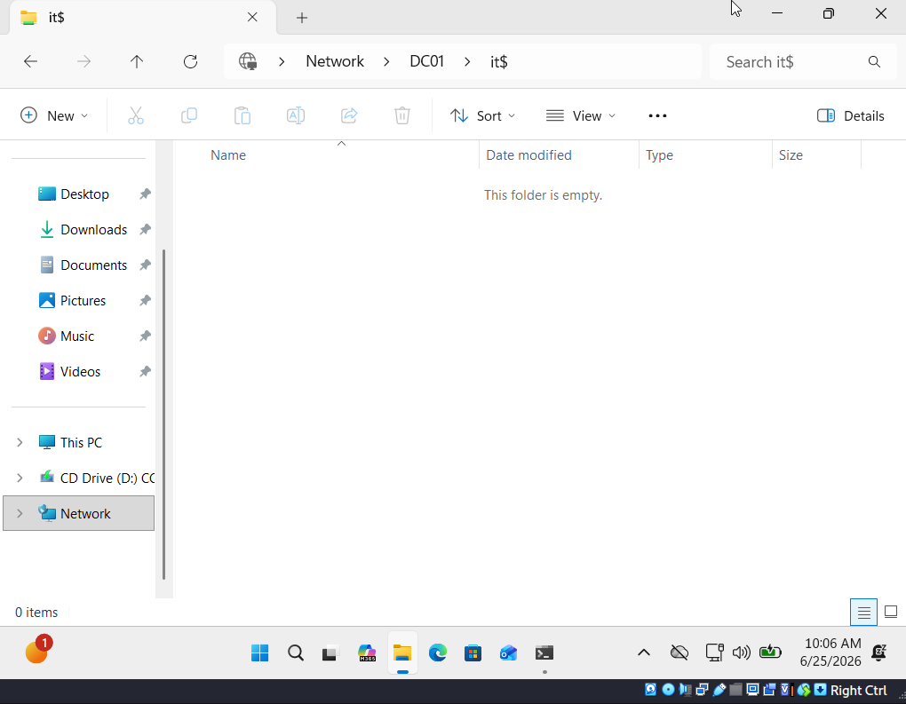

# 05 - Shared Folders & NTFS Permissions

## Goal
Create shared folders with proper NTFS permissions so only the right users and groups can access them.

## Shares Created
| Folder | Shared Name | Access |
|--------|-------------|--------|
| C:\Shares\IT | IT$ | IT-Team only |
| C:\Shares\HR | HR$ | HR-Team only |
| C:\Shares\Finance | Finance$ | Finance-Team only |
| C:\Shares\Management | Management$ | Management-Team only |

## Steps
1. Create folders under C:\Shares on the server
2. Right click folder → Properties → Sharing → Advanced Sharing
3. Enable sharing and set share permissions per group
4. Security tab → Advanced → Disable inheritance → remove Users → add SYSTEM, Administrators, and matching group
5. Test access from Windows 11 client with different user accounts

## Verification
- Ahmed Alaa (IT) can access \\DC01\IT$ but not HR$ or Finance$
- Amer Ahmed (HR) can access \\DC01\HR$ but not IT$ or Finance$

## Screenshots

