# 06 - Group Policy Objects (GPO)

## Goal
Create and apply Group Policy Objects to enforce security settings and desktop restrictions across the domain.

## GPOs Created
| GPO Name | Linked To | Purpose |
|----------|-----------|---------|
| Password Policy | homelab.local | Enforce strong passwords |
| Login Banner | homelab.local | Display warning message at login |
| Disable Control Panel | HR OU | Restrict HR users from Control Panel |
| Mapped Drives | IT OU | Auto map IT share drive |

## Steps
1. Open Group Policy Management
2. Right click domain or OU → Create a GPO and link it here
3. Right click GPO → Edit
4. Configure the required settings
5. Run gpupdate /force on client machine
6. Verify policy applied with gpresult /r

## Key Settings
- Minimum password length: 10 characters
- Password history: 5 passwords remembered
- Account lockout threshold: 5 attempts
- Login banner text: "Authorized users only. All activity is monitored."

## Screenshots

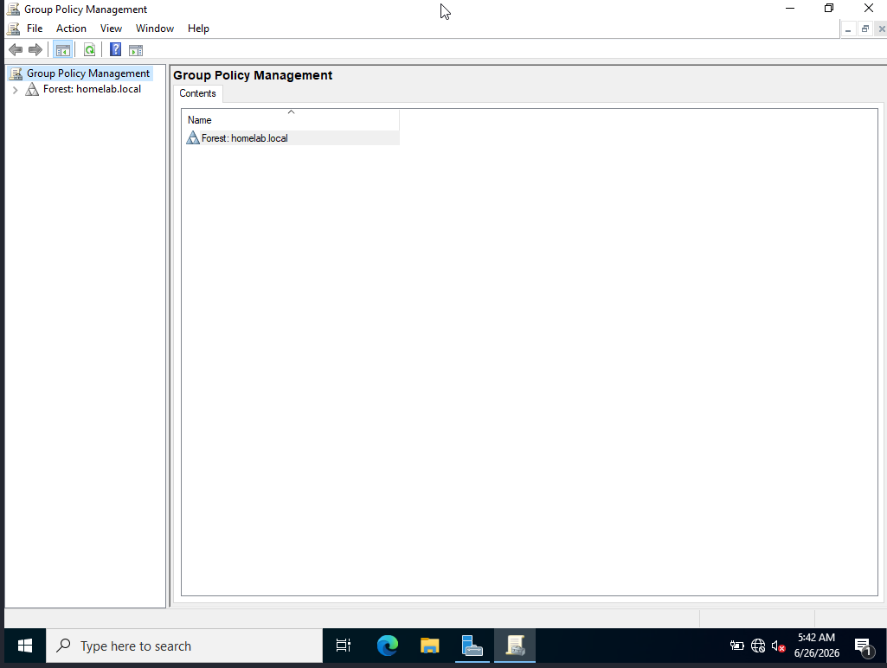
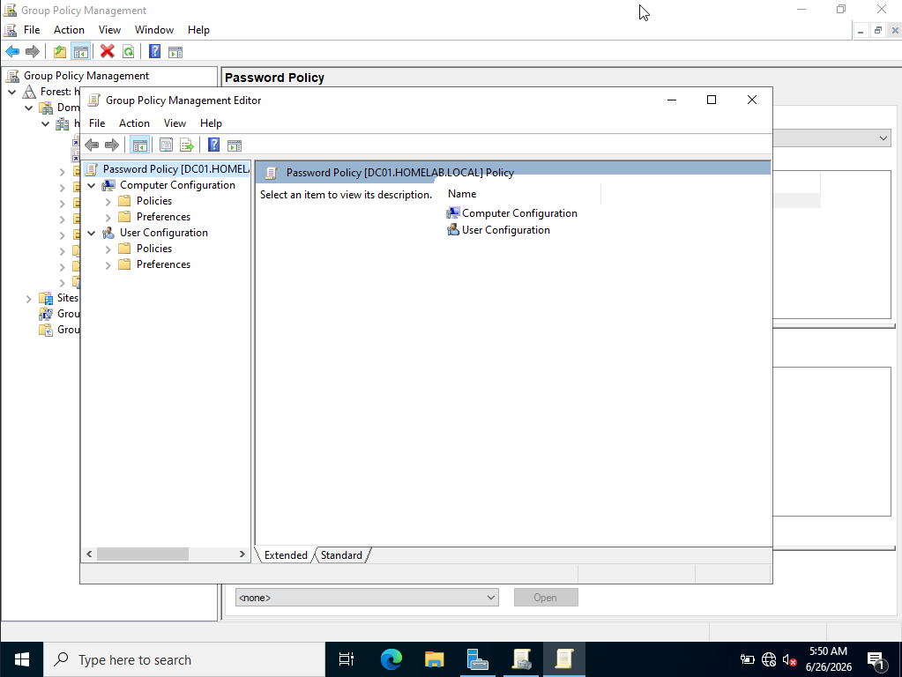
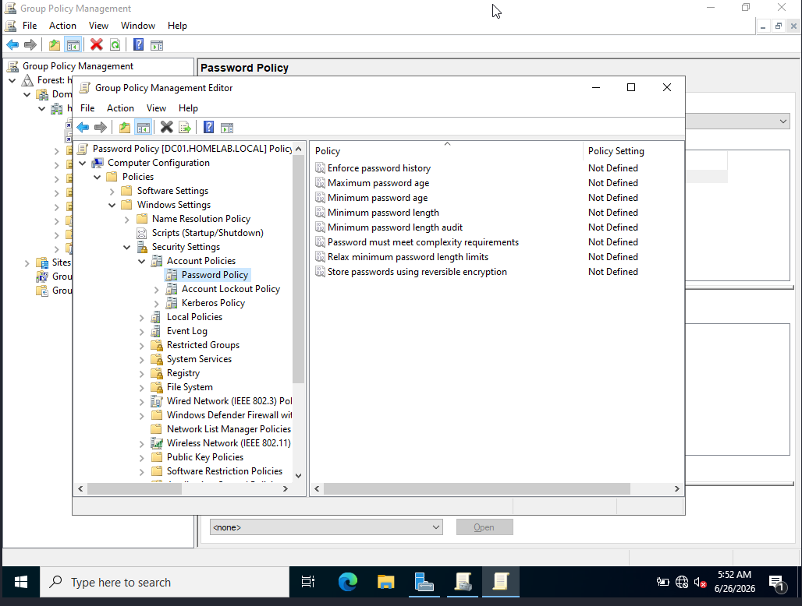
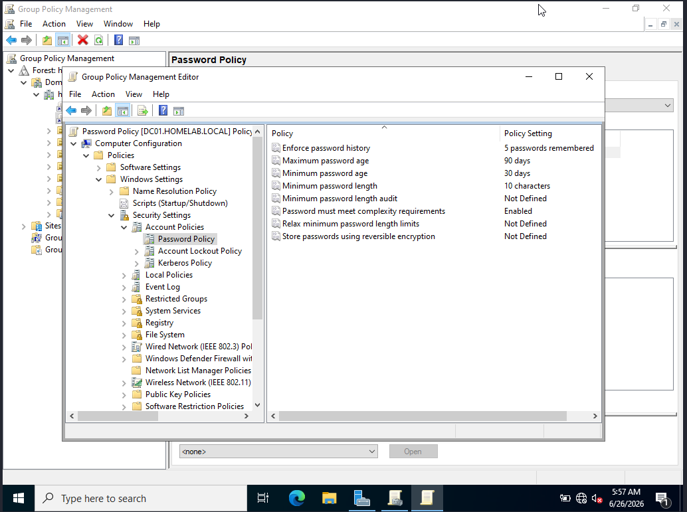
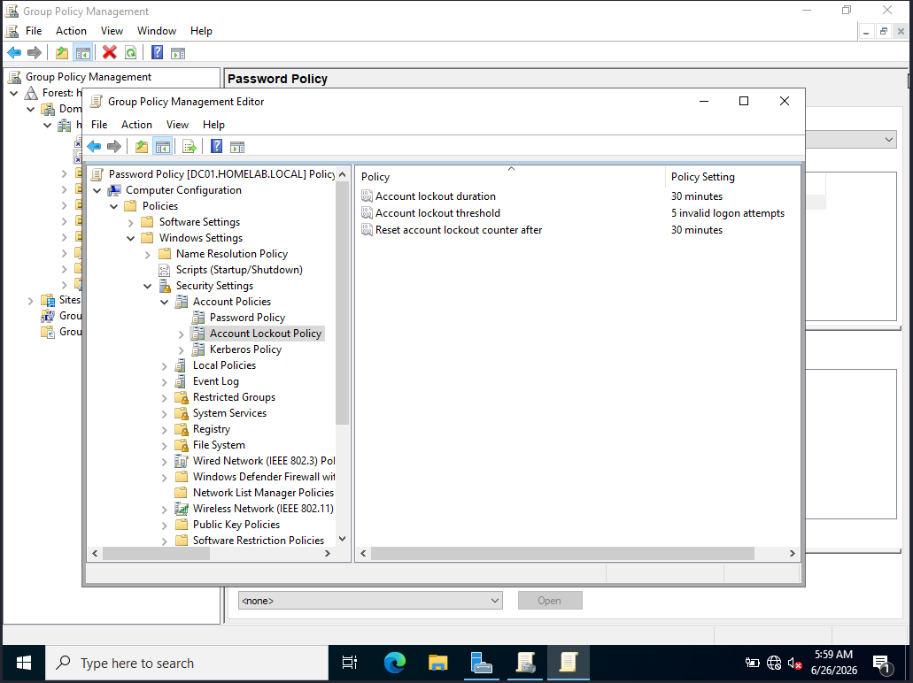
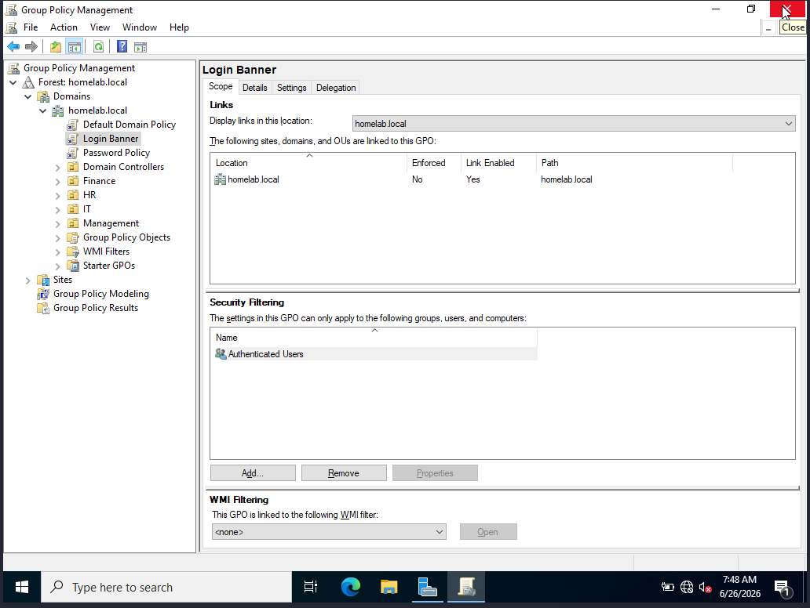
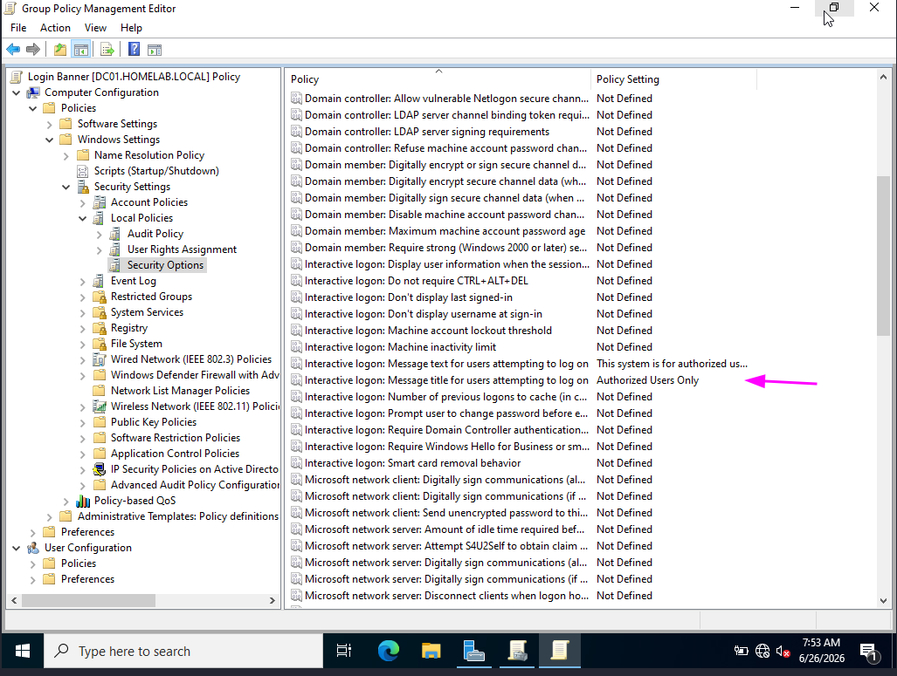
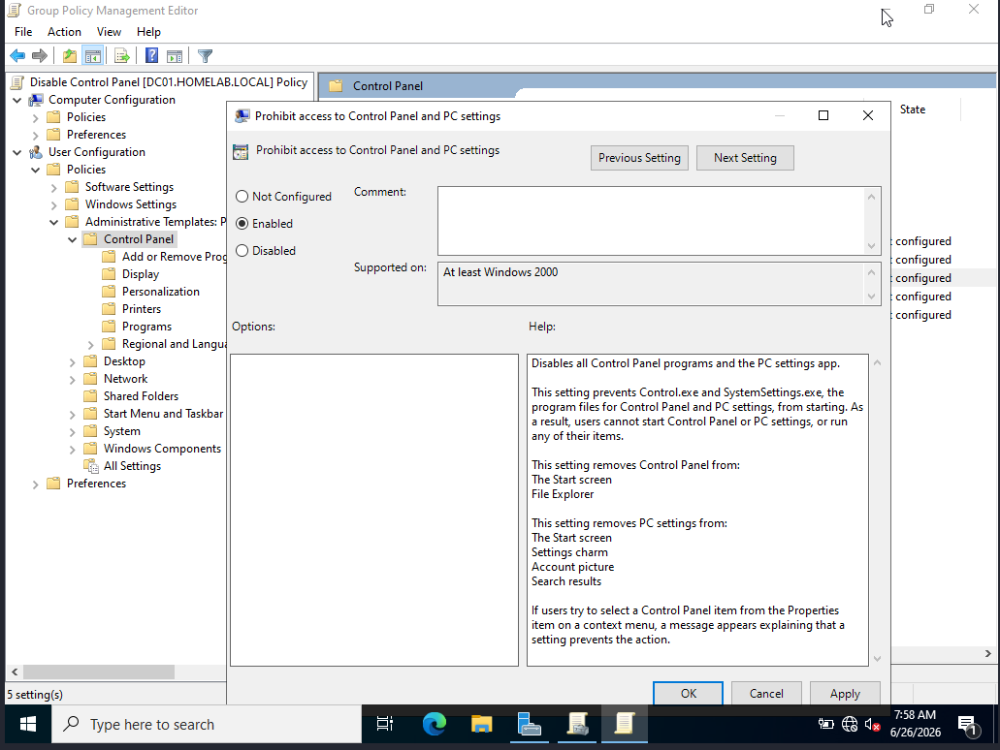
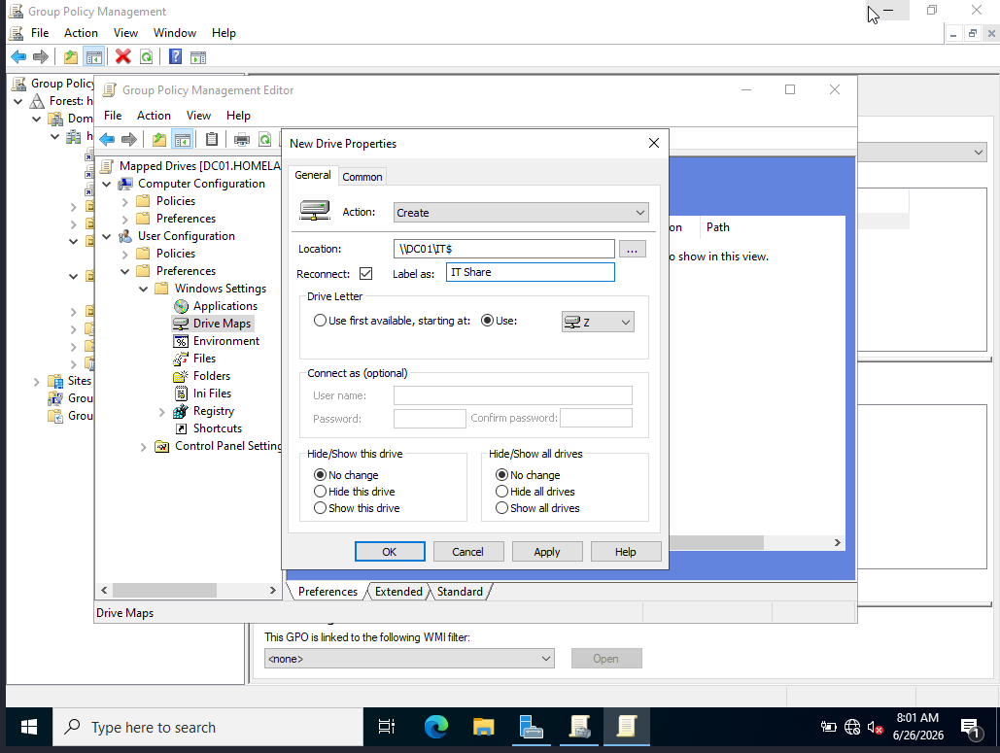
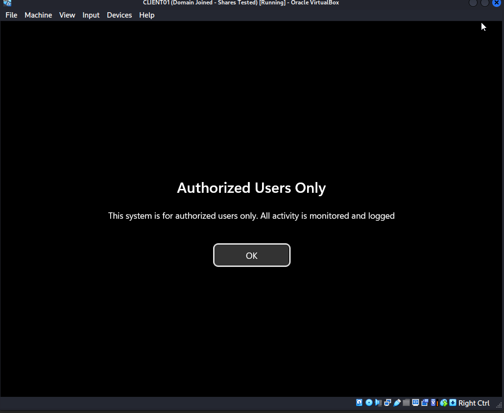
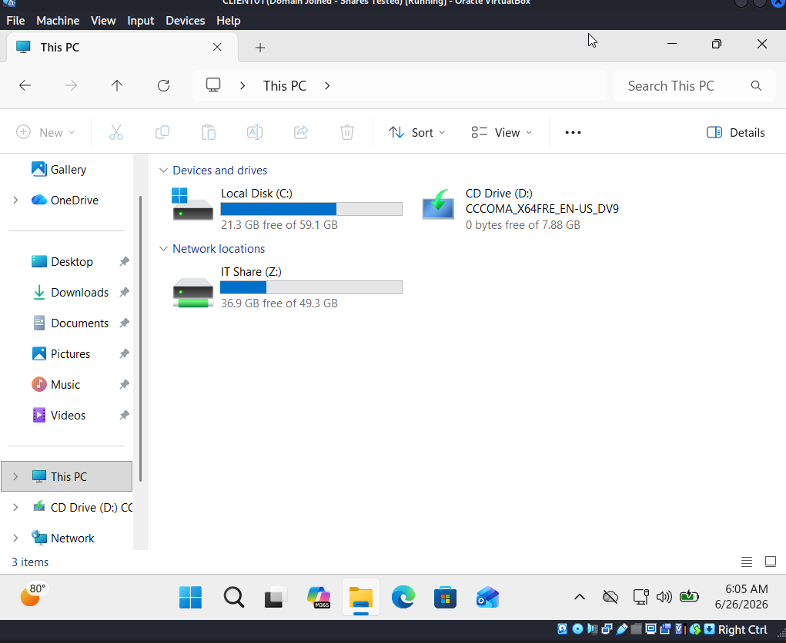
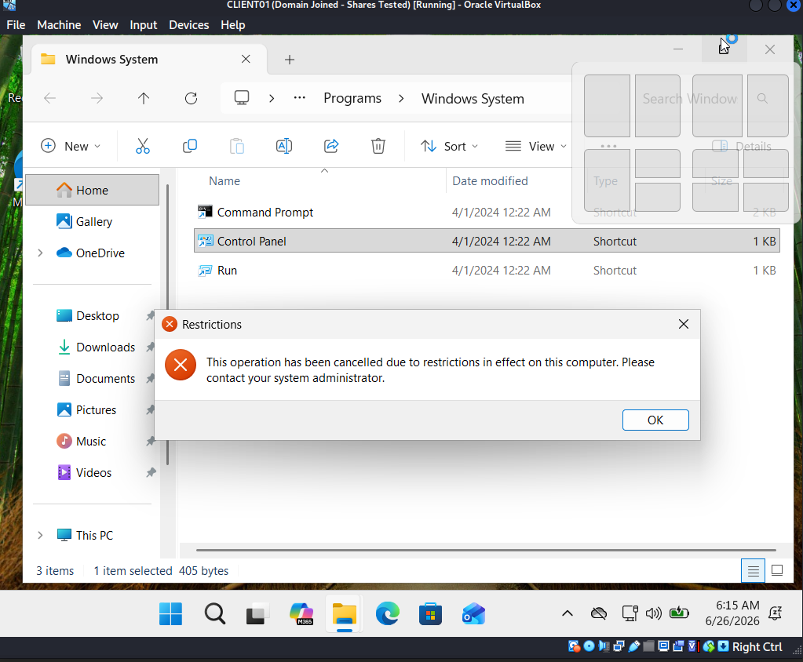
