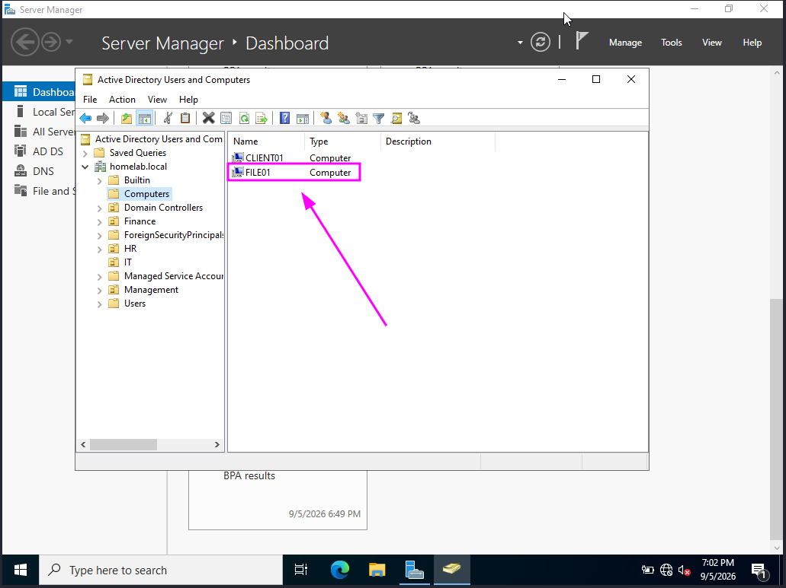
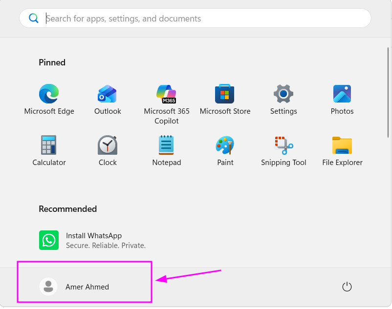
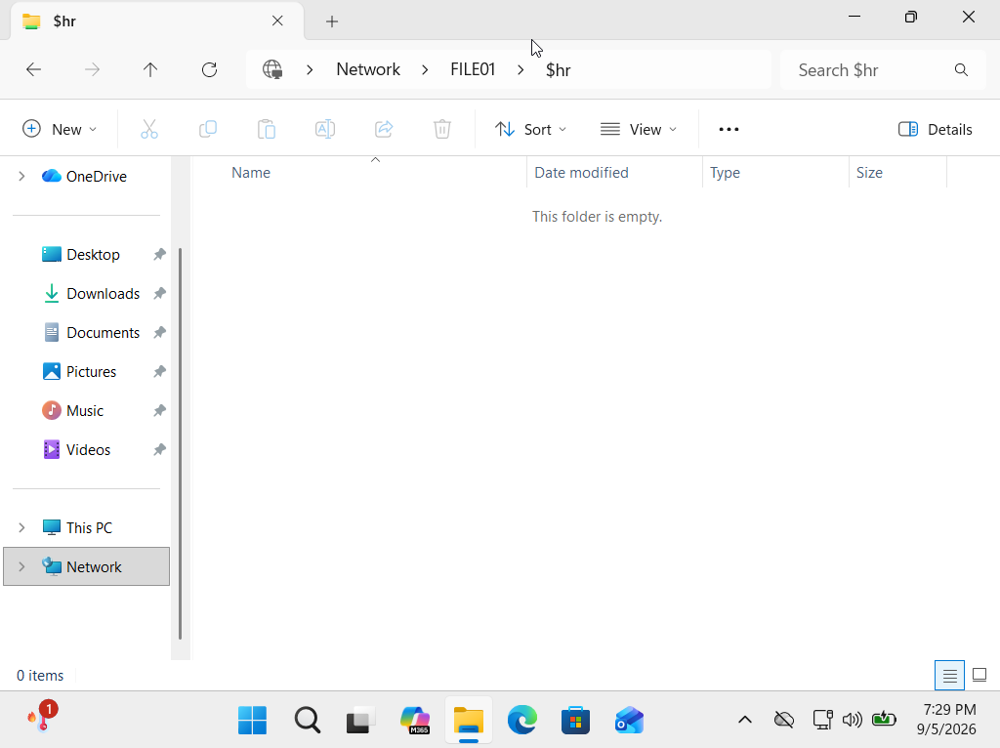
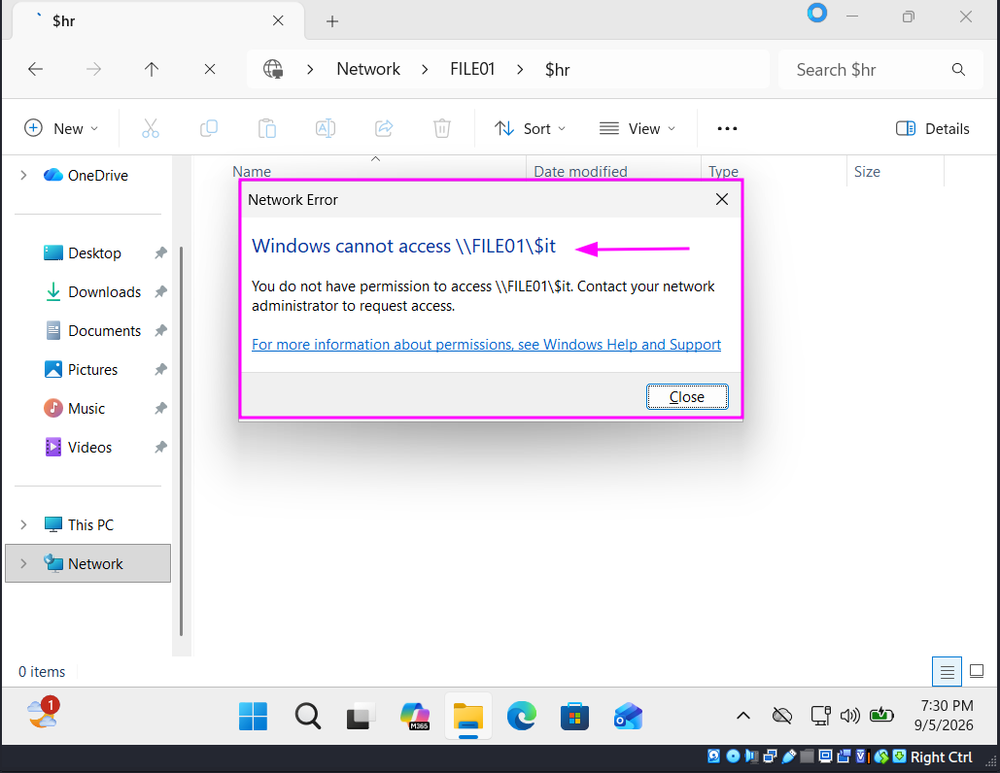
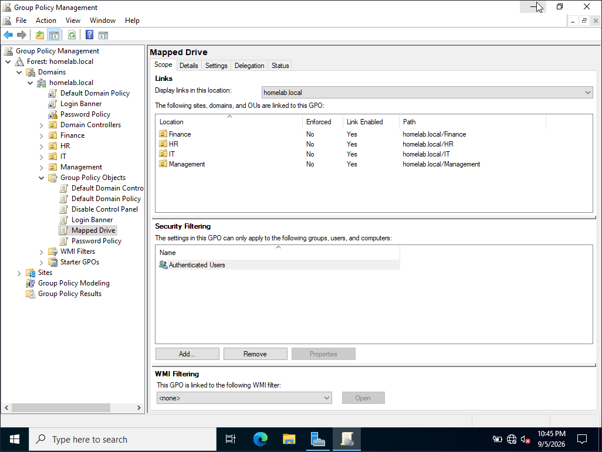
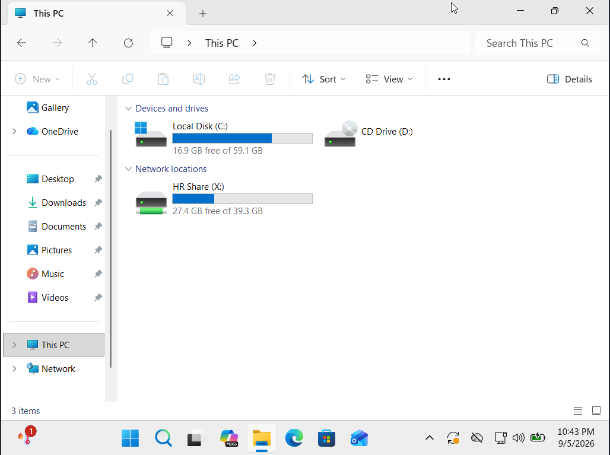
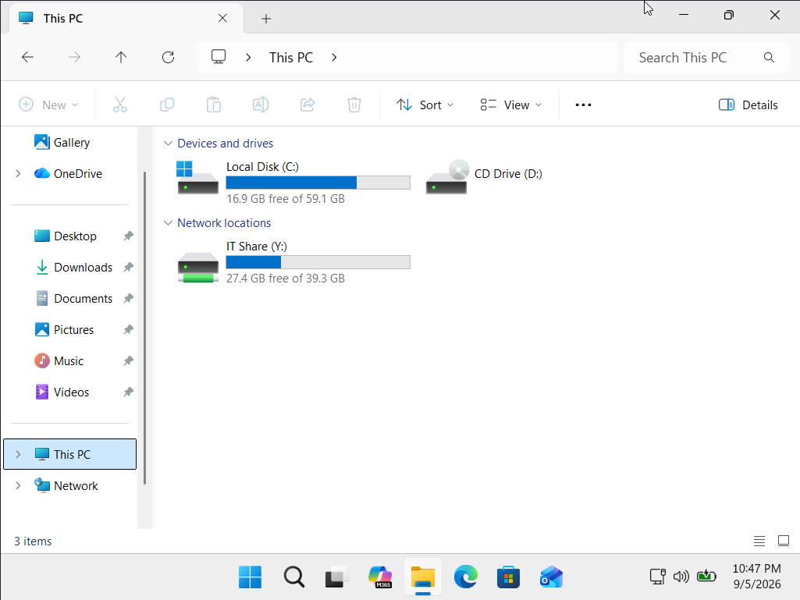

# 08 - File Server (FILE01)

## Goal
Move file sharing responsibilities off the Domain Controller (DC01) onto a dedicated File Server (FILE01), since hosting shares directly on a DC is not a best practice in real-world environments.

## VM Specs
**RAM:** 2048 MB
**Storage:** 40 GB
**CPUs:** 2
**Network:** NAT (Adapter 1) + Host-Only vboxnet0 (Adapter 2)
**Static IP:** 192.168.56.103
**DNS:** 192.168.56.102

## Steps
---
### Step 1 - VM Creation and Windows Installation
**Details:** Created FILE01 in VirtualBox with the specs above and installed Windows Server 2022 (Desktop Experience).
**Issue:** VirtualBox's Unattended Installation failed with "Windows cannot find the Microsoft Software License Terms."
**Fix:** Recreated the VM with Unattended Installation unchecked and completed a standard manual install instead.
---
### Step 2 - Domain Join
**Details:** Renamed the computer to FILE01, set the static IP/DNS, and joined it to the homelab.local domain. Confirmed it appears in Active Directory Users and Computers.

---
### Step 3 - Shared Folders and Permissions
**Details:** Recreated the department folder structure (IT, HR, Finance, Management) on FILE01, shared each folder, and applied NTFS + Share permissions matching each department's security group. Tested access per department from CLIENT01.

---
### Step 4 - Mapped Drives GPO Update
**Details:** Updated the Mapped Drives GPO to use Item-Level Targeting by OU, giving each department its own drive letter, all pointing to FILE01 instead of DC01.
- IT → Z: → \\FILE01\IT$
- HR → X: → \\FILE01\HR$
- Finance → Y: → \\FILE01\Finance$
- Management → W: → \\FILE01\Management$

---
### Step 5 - DC01 Decommission
**Details:** Removed the old shares from DC01 after confirming FILE01 was fully functional, keeping the Domain Controller clean of unrelated roles.
