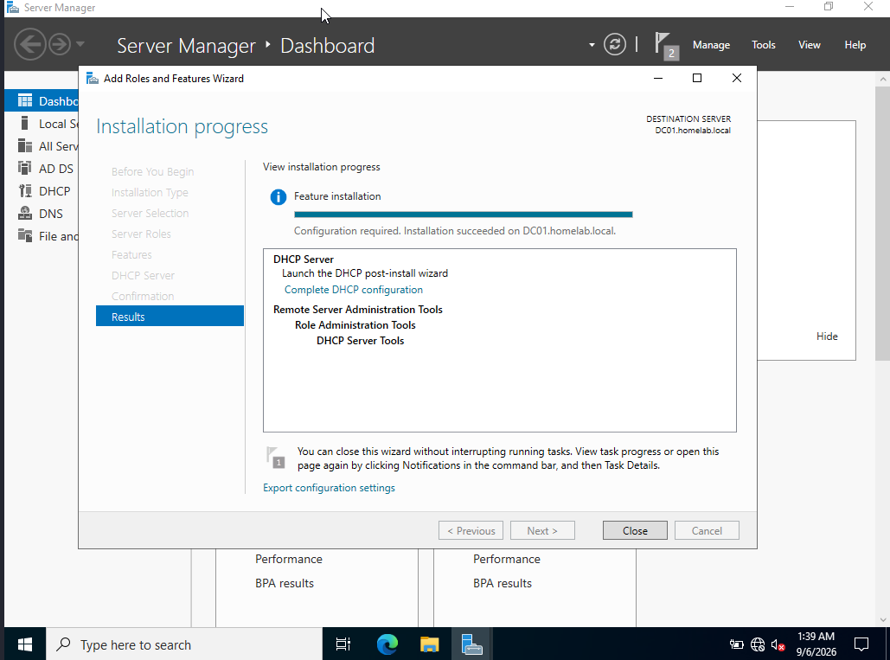
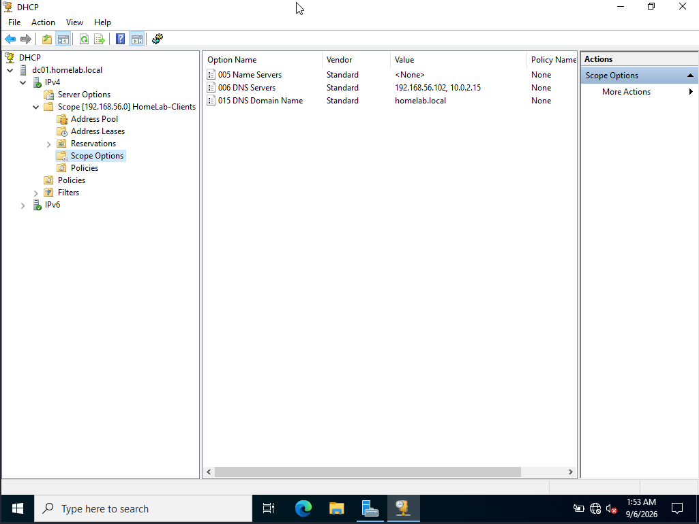
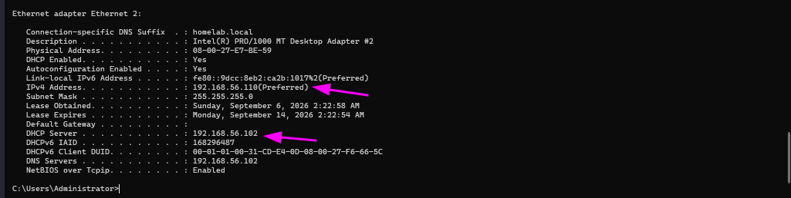
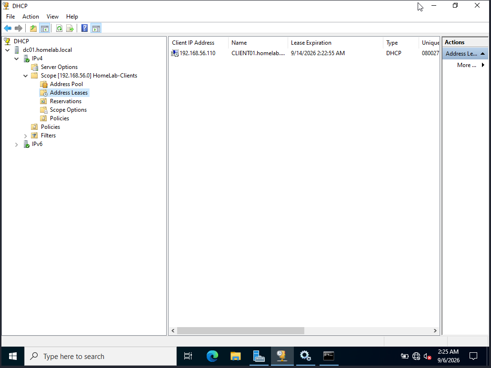

# 09 - DHCP Server

## Goal
Replace static IP assignment for client machines with a centrally managed DHCP scope, following standard small-business design: servers keep static IPs, clients get dynamic ones.

## Design
**Role location:** DC01
**Static range (reserved for servers):** 192.168.56.100 - .109
**Scope name:** HomeLab-Clients
**Scope range:** 192.168.56.110 - 192.168.56.200
**Scope Option 006 (DNS Servers):** 192.168.56.102
**Scope Option 015 (Domain Name):** homelab.local

## Steps
---
### Step 1 - Install and Configure the DHCP Role
**Details:** Installed the DHCP Server role on DC01 via Server Manager, completed post-deployment authorization, created the HomeLab-Clients scope (192.168.56.110-200), and configured DNS/domain scope options.

---
### Step 2 - Client Testing
**Details:** Switched CLIENT01 from static IP to "Obtain an IP address automatically" and renewed its lease to confirm it received an address from the new scope.

---
### Scenario 1 - Authorization Error 20079
**Problem:** DHCP post-install wizard reported "The authorization of DHCP server failed with Error Code: 20079."
**Diagnosis:** Checked Manage Authorized Servers in the DHCP console — DC01 was already listed as authorized. The error was a known, harmless message.
**Fix:** No action needed; confirmed authorization was already in place.
---
### Scenario 2 - Client Stuck on APIPA Address
**Problem:** CLIENT01 kept receiving a 169.254.x.x self-assigned address instead of a lease.
**Diagnosis:** VirtualBox's built-in DHCP server on the vboxnet0 Host-Only network was still enabled and competing with DC01's DHCP role.
**Fix:** Disabled the DHCP server under VirtualBox Host Network Manager → vboxnet0 → DHCP Server tab.
---
### Scenario 3 - Duplicate DNS Entry in Scope Options
**Problem:** Client still failed to get a correct lease after fixing Scenario 2.
**Diagnosis:** An extra, incorrect IP had been added alongside the correct DC01 address under Scope Option 006 (DNS Servers).
**Fix:** Removed the stray entry, leaving only 192.168.56.102 — CLIENT01 correctly received 192.168.56.110.
