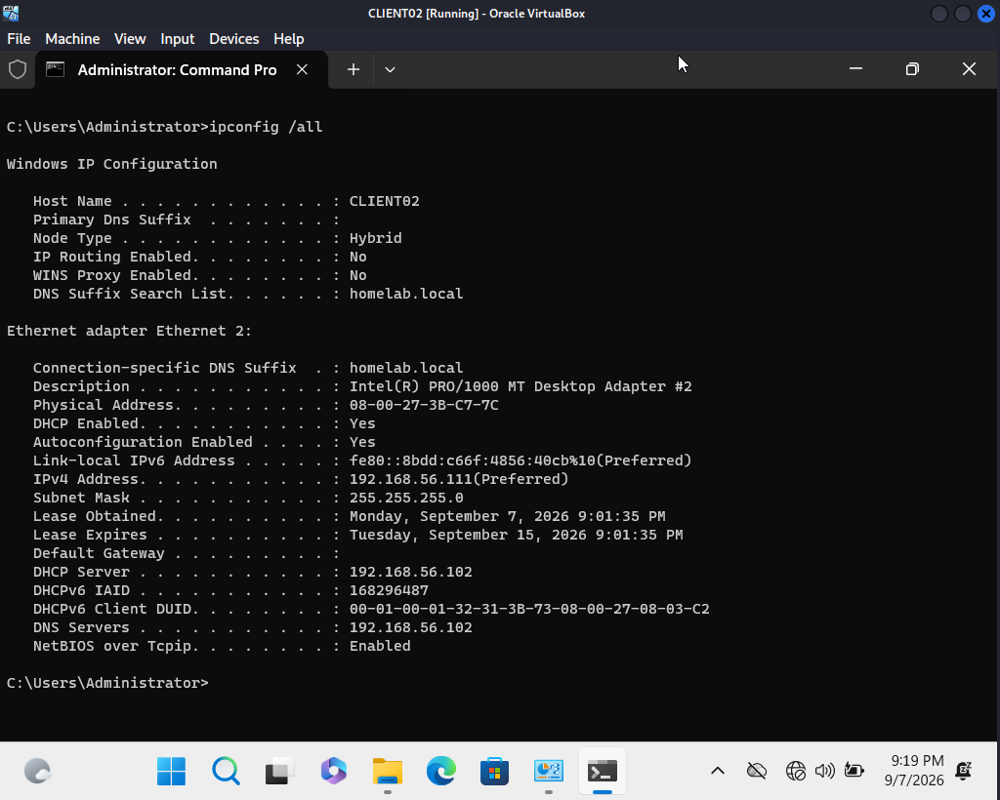
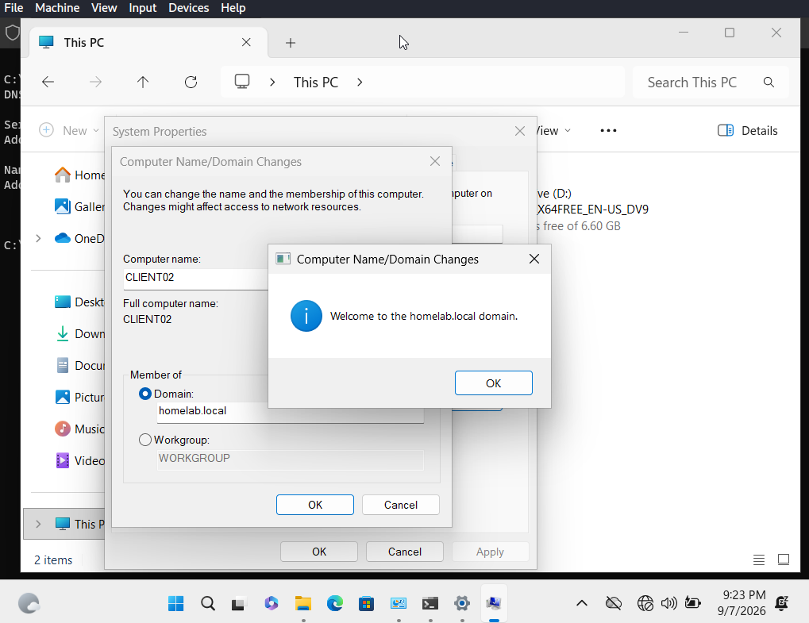
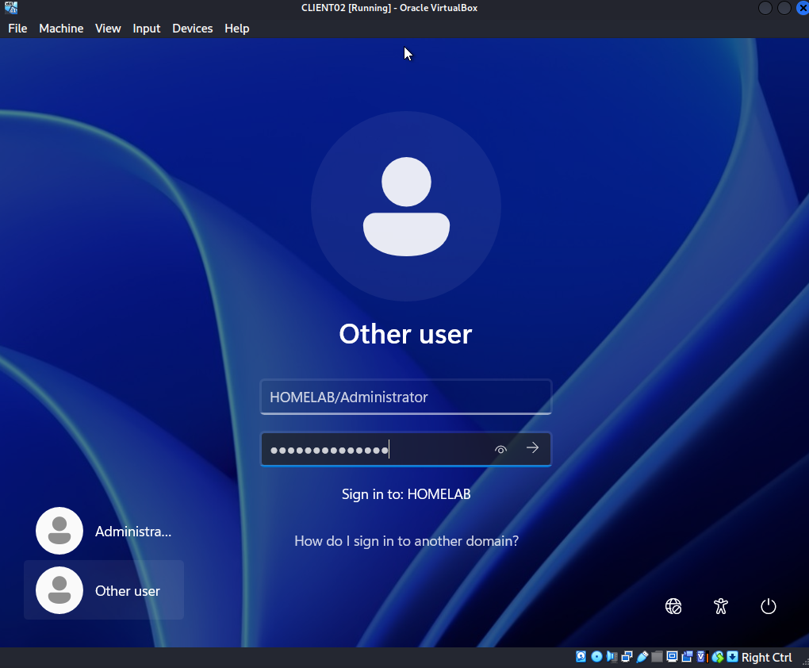
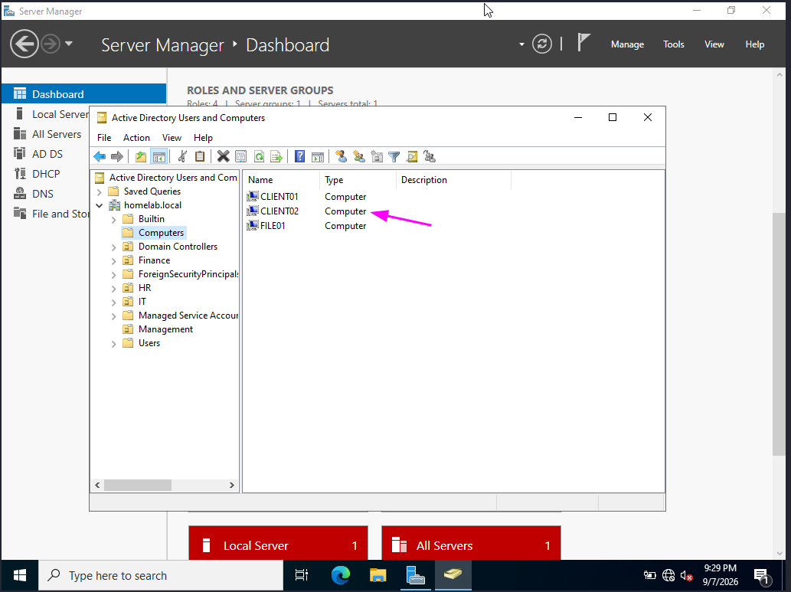
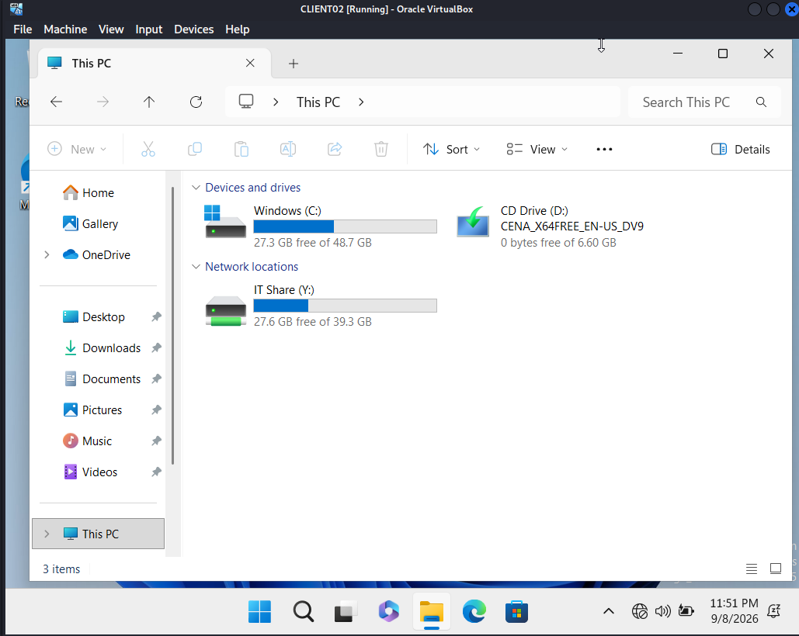
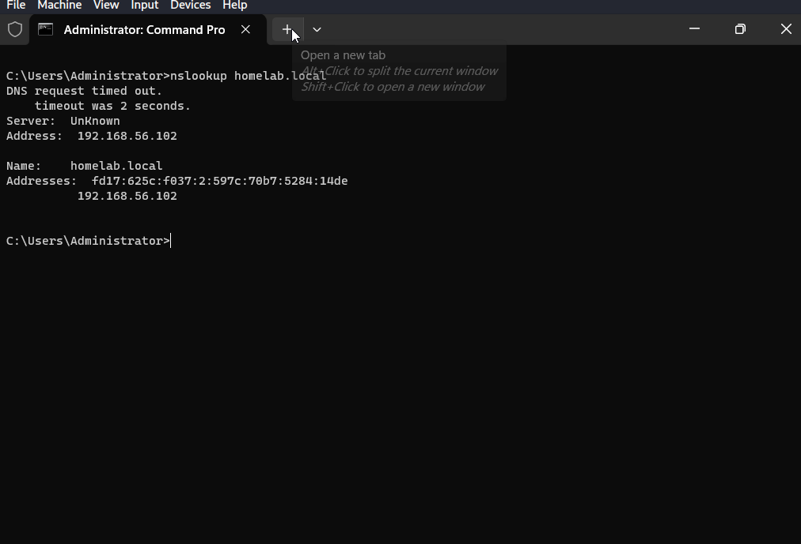

# 10 - CLIENT02 (Domain Client)

## Goal
Add a second Windows 11 client to the domain to prove that AD permissions, GPOs, and mapped drives are tied to the user identity — not to a specific machine.

## VM Specs
**OS:** Windows 11 Enterprise Evaluation 25H2 x64
**RAM:** 2048 MB
**CPUs:** 2
**Storage:** 40 GB dynamically allocated VDI
**Network:** Host-Only (vboxnet0)

## Steps
---
### Step 1 - ISO Verification and VM Creation
**Details:** Downloaded the Windows 11 Enterprise Evaluation ISO and verified its integrity using SHA-256 before use, confirming it matched Microsoft's published hash. Created CLIENT02 in VirtualBox using Unattended Installation, which completed successfully this time.
---
### Step 2 - DHCP and Domain Join
**Details:** CLIENT02 obtained an IP via DHCP (192.168.56.111) from DC01, then was joined to the homelab.local domain.

---
### Step 3 - Cross-Device Permissions Test
**Details:** Logged into CLIENT02 as Ahmed Alaa (IT) and confirmed the IT mapped drive appeared automatically and pointed to the correct share, proving that department permissions and GPO targeting follow the user, not the device.

---
### Scenario 1 - Network Adapter Misconfigured (NAT instead of Host-Only)
**Problem:** CLIENT02 was initially configured with a NAT adapter only and could not reach DC01 or FILE01.
**Diagnosis:** VirtualBox's Basic settings only exposed NAT/Bridged options; Host-Only wasn't visible until Expert Settings was enabled.
**Fix:** Enabled Expert Settings in the VM's network configuration and switched the adapter to Host-Only (vboxnet0), matching DC01, FILE01, and CLIENT01.
---
### Scenario 2 - DNS Resolution Timeout with Stale Record
**Problem:** `nslookup homelab.local` timed out and returned two different addresses: 192.168.56.102 and 10.0.2.15.
**Diagnosis:** 10.0.2.15 was DC01's NAT adapter address, which had incorrectly registered itself in DNS alongside the correct Host-Only address. The homelab.local domain apex also had a stray Host (A) record pointing to 10.0.2.15.
**Fix:** Corrected DC01's DNS registration and deleted the stray Host (A) record. `nslookup DC01.homelab.local` afterward returned only 192.168.56.102, and domain resolution worked correctly.

