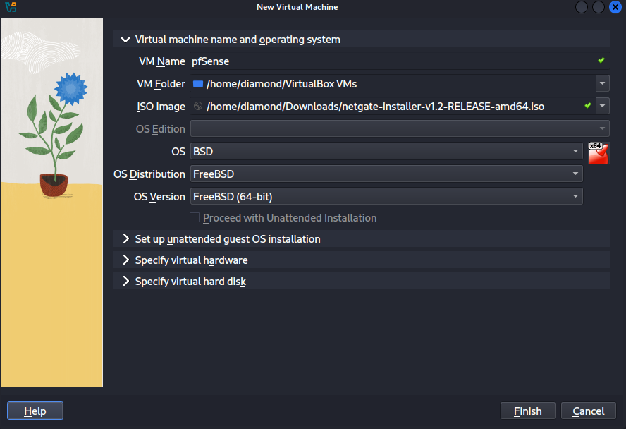
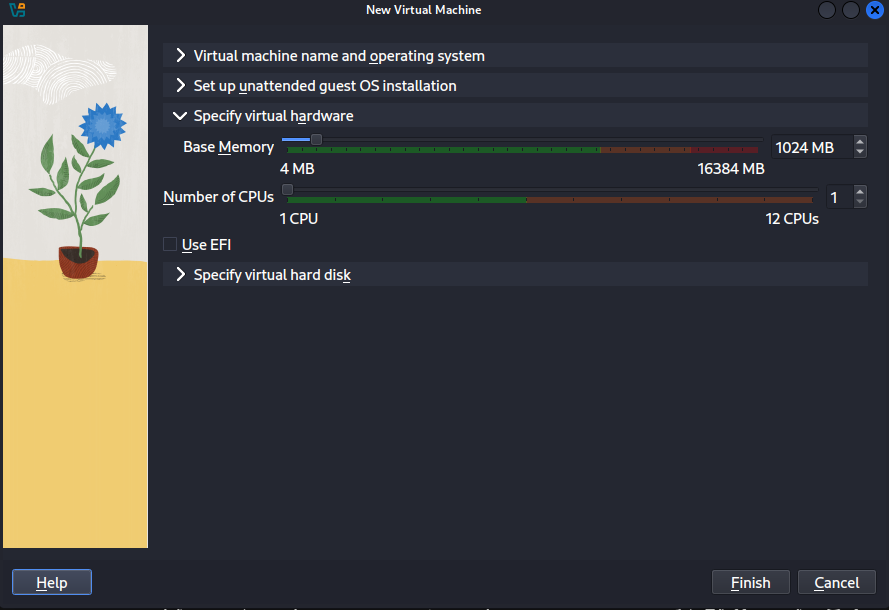
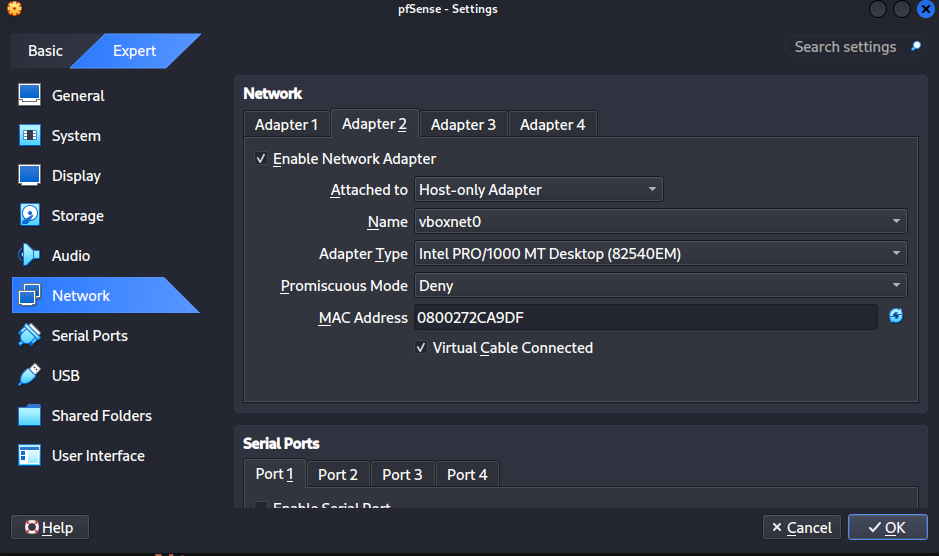
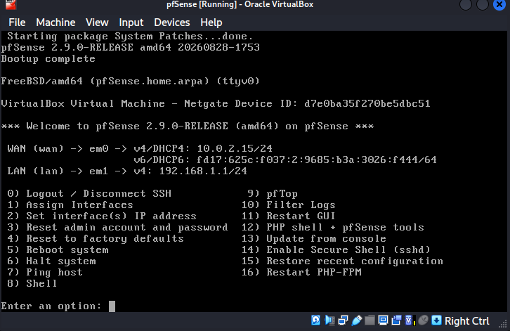
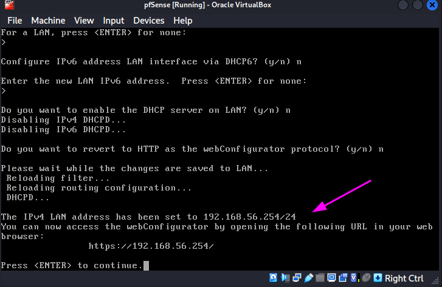

# 11 - pfSense Firewall (VM Setup)

## Goal
Deploy a pfSense (Community Edition) router/firewall VM to eventually act as the single gateway for the domain network, enabling real firewall rules, NAT control, and traffic logging beyond what Windows Firewall can provide on individual machines.

## VM Specs
**OS:** pfSense CE 2.9.0-RELEASE (FreeBSD-based)
**RAM:** 1024 MB
**CPU:** 1
**Storage:** 8 GB (ZFS)
**Network Adapter 1 (WAN):** NAT
**Network Adapter 2 (LAN):** Host-Only (vboxnet0)
**LAN IP:** 192.168.56.254 (Static)

## Steps
---
### Step 1 - VM Creation and Network Design
**Details:** Created the pfSense VM in VirtualBox. Adapter order matters for interface assignment: Adapter 1 (NAT) became WAN (em0), Adapter 2 (Host-Only) became LAN (em1) — matching the existing domain network so pfSense can later act as its gateway.

---
### Step 2 - Installation
**Details:** Installed pfSense CE using the Netgate Installer (an online installer that fetches the OS over the internet during setup — the WAN interface needs connectivity before installation can complete). Selected pfSense CE (not the commercial Plus edition) and ZFS as the filesystem.
---
### Step 3 - Interface Assignment and LAN Configuration
**Details:** Assigned em0 as WAN and em1 as LAN via the console menu. Configured the LAN interface with a static IP (192.168.56.254/24), disabled the DHCP server on LAN (DC01 already serves DHCP for the network), and kept the WebGUI protocol as HTTPS.

---
### Step 4 - WebGUI Access and Verification
**Details:** Accessed the WebGUI over HTTPS, changed the default admin password, and confirmed the dashboard shows the correct version and system info. Verified LAN connectivity by pinging DC01 (192.168.56.102) from pfSense's Diagnostics tool — 0% packet loss.

---
### Scenario 1 - VM Rebooted Back into the Installer
**Problem:** After completing installation and rebooting, the VM booted back into the Netgate Installer instead of the installed system.
**Diagnosis:** The installation ISO was still mounted in the virtual optical drive, so VirtualBox kept booting from it instead of the virtual disk.
**Fix:** Removed the ISO from the virtual drive (Settings → Storage → Remove Disk from Virtual Drive) and restarted the VM, which then booted correctly into pfSense.

## Next Steps
This VM is now a functioning router/firewall, but is not yet the network's actual gateway — every domain machine (DC01, FILE01, CLIENT01, CLIENT02) still has its own direct NAT adapter. The next phase will remove those adapters and point each machine's default gateway to pfSense (192.168.56.254), making it the single path in and out of the network.
