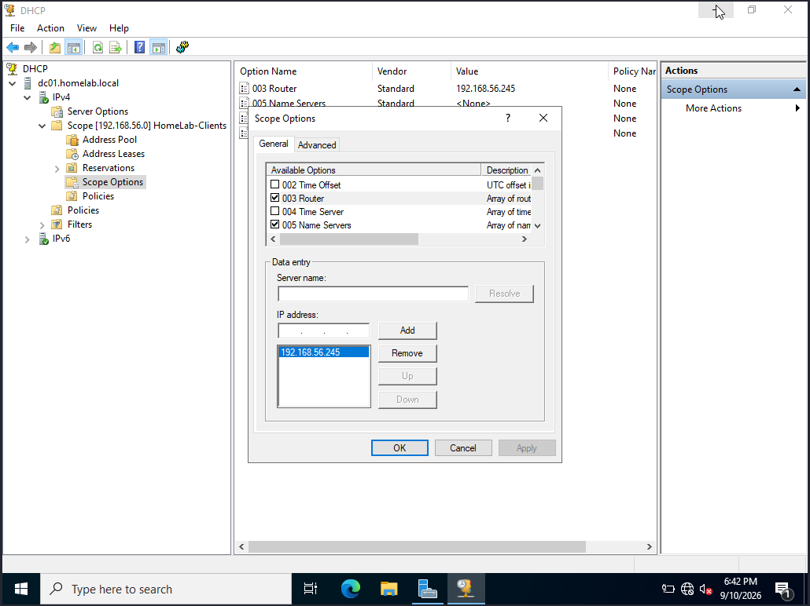
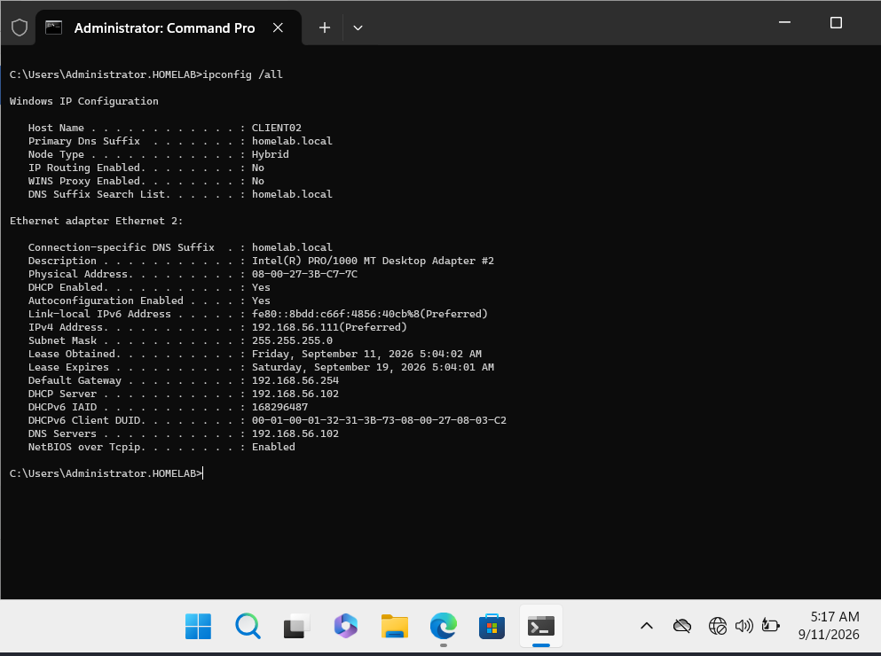
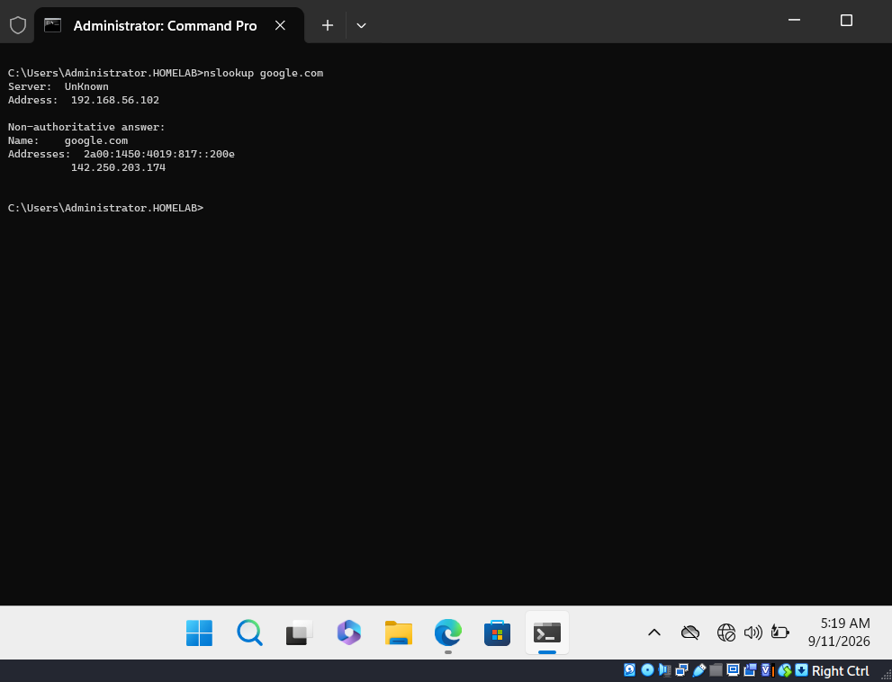
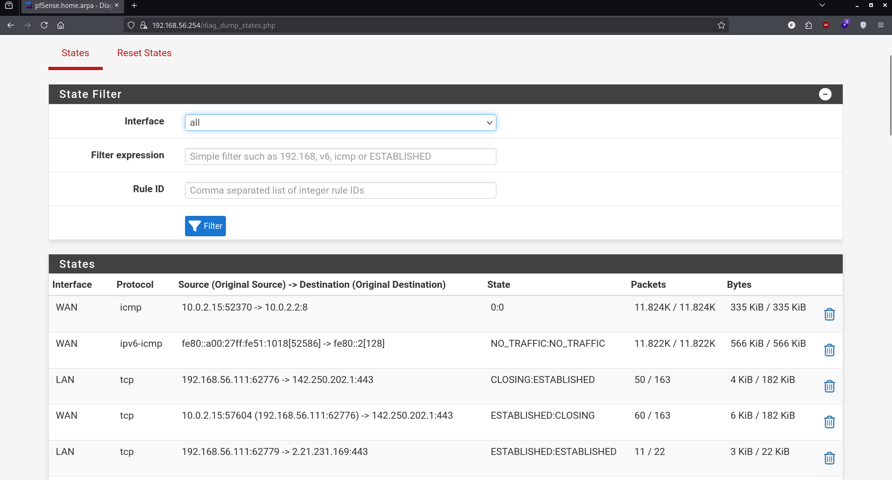

# 12 - pfSense Gateway Migration

## Goal
Make pfSense the single gateway for the entire domain network, replacing each machine's direct NAT adapter with routed traffic through pfSense's WAN — turning it from "present on the network" into "the actual path in and out."

## Design
**DHCP clients (CLIENT01, CLIENT02):** Gateway pushed automatically via DHCP Scope Option 003 (Router) = 192.168.56.254
**Static machines (DC01, FILE01):** Default Gateway manually set to 192.168.56.254 in their IPv4 properties

## Steps
---
### Step 1 - DHCP Scope Option 003 (Router)
**Details:** Added Option 003 on the DC01 DHCP scope, pointing all DHCP clients to pfSense's LAN IP as their default gateway.

---
### Step 2 - Migrate Each Machine
**Details:** For each of the four machines: disabled the NAT adapter (Adapter 1) in VirtualBox, then confirmed the new gateway (192.168.56.254) was picked up — automatically via DHCP renewal for CLIENT01/CLIENT02, or manually in IPv4 properties for DC01/FILE01.

---
### Step 3 - Verification
**Details:** Confirmed connectivity and DNS resolution on all four machines after migration.

---
### Scenario 1 - Typo in DHCP Router Option
**Problem:** After adding Option 003, CLIENT02 received Default Gateway 192.168.56.245 instead of .254.
**Diagnosis:** A typo was made when entering the IP address in the Scope Options.
**Fix:** Corrected the value in DHCP Scope Options to 192.168.56.254 and renewed the client's lease.
---
### Scenario 2 - DC01 Could Route But Not Resolve External DNS
**Problem:** After migration, CLIENT02 could ping external IPs (e.g., 8.8.8.8) through pfSense but `nslookup google.com` timed out.
**Diagnosis:** Routing was confirmed working (ping succeeded), isolating the issue to DNS. DC01 (the DNS server) had no default gateway configured — since it uses a static IP, it wasn't set automatically, and DC01 itself couldn't reach the internet to forward external DNS queries.
**Fix:** Manually set DC01's Default Gateway to 192.168.56.254.
---
### Scenario 3 - Invalid DNS Forwarders on DC01
**Problem:** Even after fixing DC01's gateway, `nslookup google.com` still failed on DC01 itself.
**Diagnosis:** DC01's DNS Forwarders list (System Properties → DNS → Forwarders) contained stale/invalid entries (old IPv6 defaults and unreachable IPv4 addresses), left over from earlier configuration or defaults.
**Fix:** Removed the invalid forwarder entries and added valid public DNS servers (8.8.8.8, 1.1.1.1). External DNS resolution then worked correctly on DC01 and cascaded to all clients.
