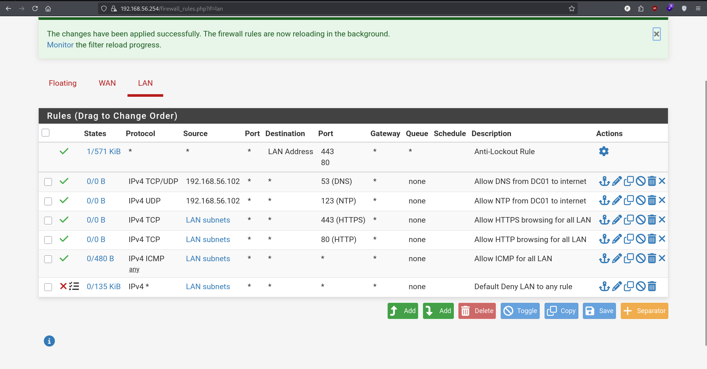
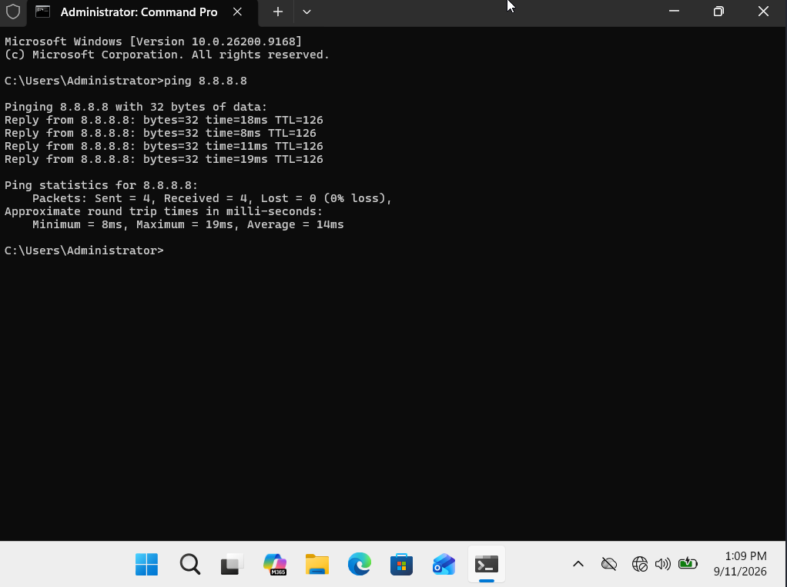
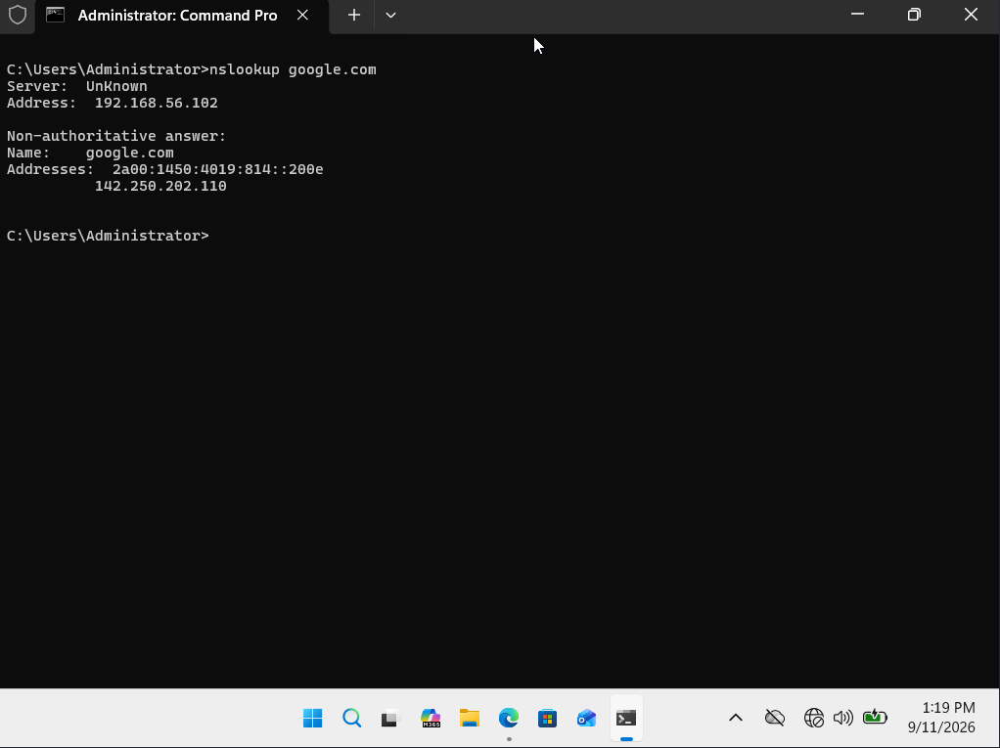
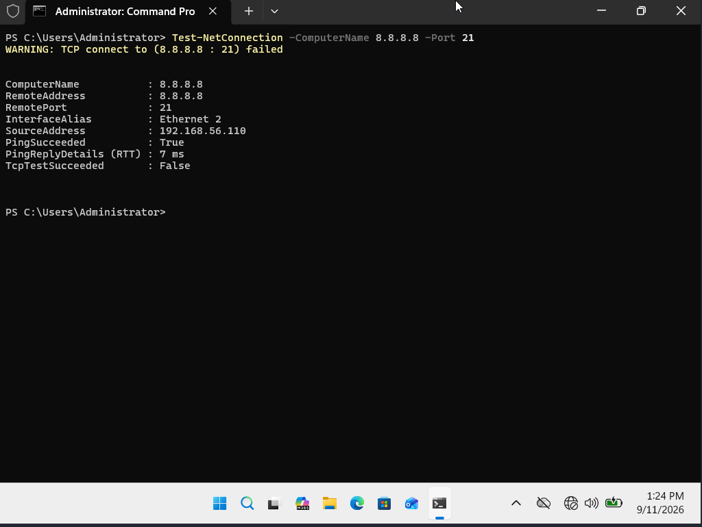

# 13 - pfSense Firewall Rules (Default Deny Policy)

## Goal
Replace the default "allow all outbound" LAN rule with a Default Deny (whitelist) security model — the industry best-practice approach where all traffic is blocked by default and only explicitly required protocols are allowed out. This mirrors how production networks are hardened in the real world.

## Design
Traffic between LAN hosts (DC01, FILE01, CLIENT01, CLIENT02) stays entirely local (same subnet) and never passes through pfSense — these rules only govern what leaves the network toward the internet (WAN).

| Rule | Protocol | Source | Destination Port | Purpose |
|---|---|---|---|---|
| Allow DNS | TCP/UDP | DC01 only (192.168.56.102) | 53 | Only DC01 forwards external DNS queries; other machines query DC01 internally |
| Allow NTP | UDP | DC01 only | 123 | Domain time sync — required for Kerberos authentication to avoid clock drift issues |
| Allow HTTPS | TCP | LAN subnets | 443 | General web browsing, Windows Update, software updates |
| Allow HTTP | TCP | LAN subnets | 80 | Legacy redirects and some update mechanisms |
| Allow ICMP | ICMP | LAN subnets | — | Deliberate choice to allow ping for lab troubleshooting convenience (would typically be restricted further in a hardened production environment) |
| **Deny all** | * | LAN subnets | * | Catch-all rule at the bottom — anything not explicitly allowed above is blocked |

## Steps
---
### Step 1 - Build the Rule Set
**Details:** Added each Allow rule above the existing default rule, then converted pfSense's auto-created "Default allow LAN to any rule" into a Block rule instead of deleting it, keeping it as the final catch-all. The built-in Anti-Lockout Rule was left untouched to preserve WebGUI access.

---
### Step 2 - Verify Allowed Traffic
**Details:** Confirmed ICMP, DNS, and HTTPS all pass correctly under the new policy.

---
### Step 3 - Verify Blocked Traffic
**Details:** Confirmed that a protocol with no explicit Allow rule (e.g., FTP port 21) is blocked automatically by the catch-all Deny rule — no separate rule was needed to block it, demonstrating the core benefit of a whitelist model over trying to blacklist every risky protocol individually.

---
### Scenario 1 - DNS Rule Blocked Most Queries (TCP-only)
**Problem:** After building the Default Deny policy, CLIENT01 could ping successfully but `nslookup google.com` failed, while CLIENT02 worked fine.
**Diagnosis:** The Allow DNS rule was set to TCP only. The vast majority of DNS queries use UDP; TCP is only used in edge cases (large responses, zone transfers). Traffic that happened to succeed on CLIENT02 was likely served from a cached result.
**Fix:** Changed the DNS rule's protocol from TCP to TCP/UDP, allowing standard DNS queries through. Confirmed working on both clients afterward.

## Design Decision Worth Noting
RDP is intentionally **not** allowed inbound from WAN under this policy — exposing RDP directly to the internet is a well-known ransomware entry vector. Remote access will instead be provided through a VPN tunnel in the next phase, following the standard "VPN first, then RDP through it" pattern used in real enterprise networks.
