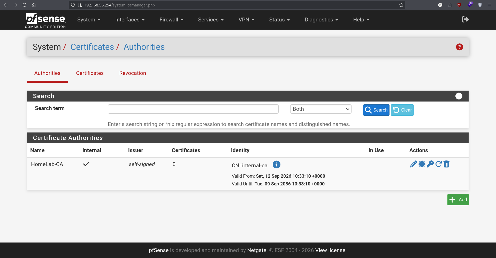
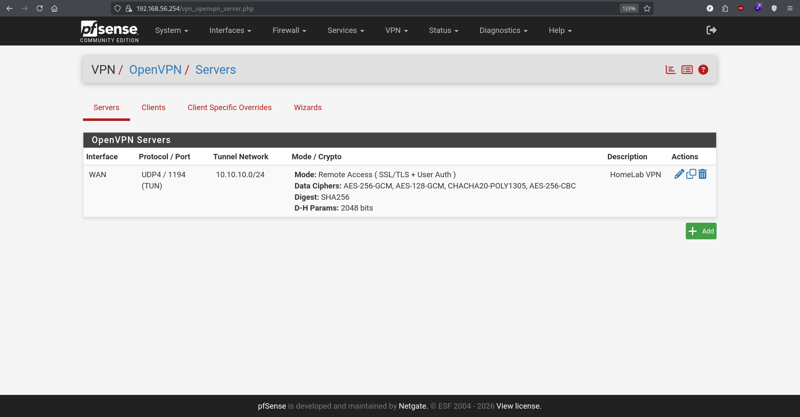
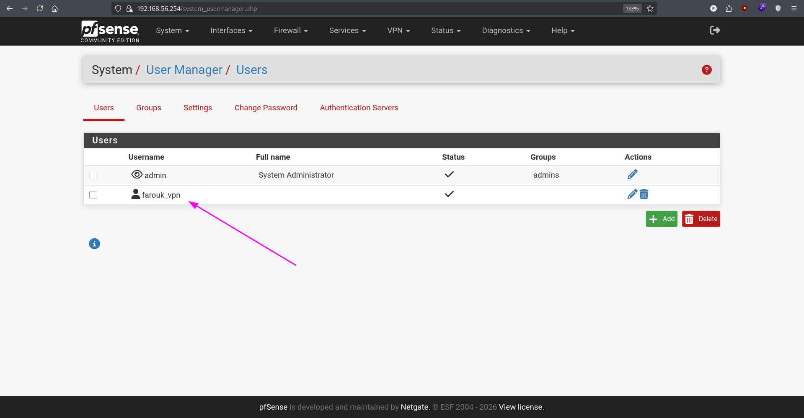
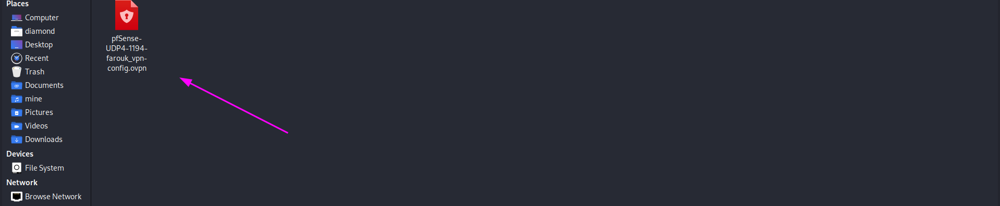
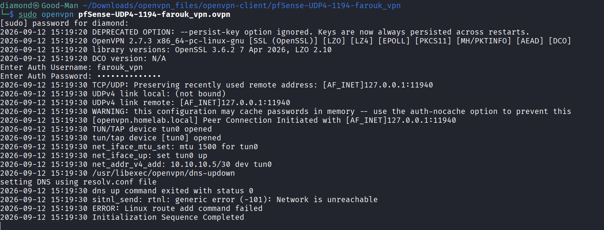
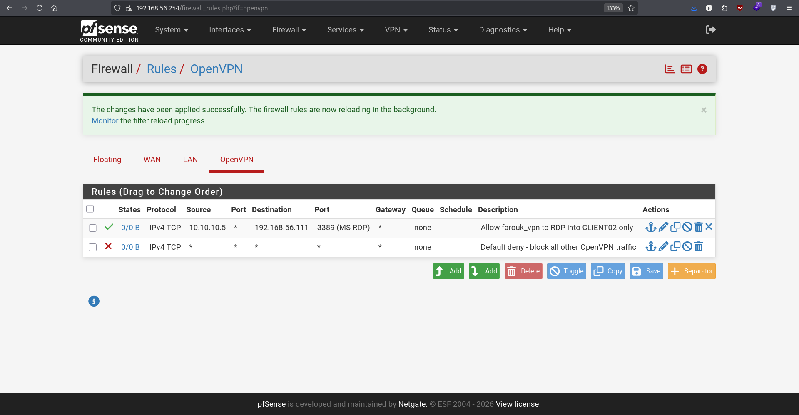
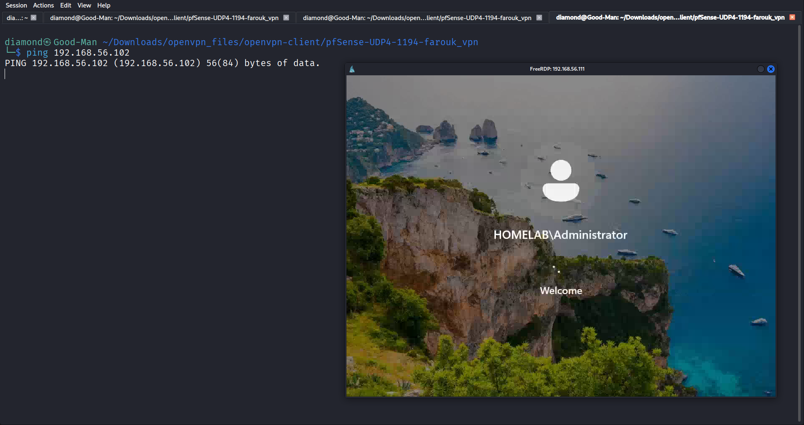

# 14 - VPN (OpenVPN) - Secure Remote Access to CLIENT02

## Goal
Provide secure remote access into the domain network without exposing RDP directly to the internet — a well-known ransomware entry vector. Instead, a remote user (simulated by Kali, acting as an external client) must connect through an OpenVPN tunnel first, and even then is restricted to RDP access on a single target machine (CLIENT02) only — following the principle of least privilege.

## Design
**VPN Type:** OpenVPN (Remote Access, SSL/TLS, Local User Access)
**Tunnel Network:** 10.10.10.0/24
**Port:** UDP 1194
**Client:** Kali (simulating an external/remote user)
**Client-Specific Override:** farouk_vpn is pinned to a fixed tunnel IP (10.10.10.5/30) instead of a random address from the pool
**Access Policy:** Only RDP (3389) from 10.10.10.5 to CLIENT02 (192.168.56.111) is allowed; everything else on the OpenVPN interface is denied by default.

## Steps
---
### Step 1 - Certificate Authority and Server Setup
**Details:** Created an internal Certificate Authority (HomeLab-CA), then ran the OpenVPN Remote Access wizard: Local User Access, UDP/1194 on WAN, tunnel network 10.10.10.0/24, local network 192.168.56.0/24, DNS server set to DC01. Declined the wizard's automatic firewall rule options in order to configure access rules manually and precisely afterward.


---
### Step 2 - VPN User and Certificate
**Details:** Created a local user (farouk_vpn) with an attached user certificate signed by HomeLab-CA, required for the Local User Access authentication mode.

---
### Step 3 - Client Export and Connection
**Details:** Installed the OpenVPN Client Export package and exported a full configuration archive (config + keys) for the farouk_vpn user. Configured VirtualBox NAT port forwarding (host UDP 11940 → guest 1194) on the pfSense VM so Kali, sitting outside the lab's Host-Only network, could reach pfSense's WAN as a genuine external client would reach a public IP.


---
### Step 4 - Least-Privilege Access Rules
**Details:** Added a Client-Specific Override giving farouk_vpn a fixed tunnel IP (10.10.10.5/30) instead of a floating address from the pool. Built two rules on the OpenVPN interface: an explicit Pass rule (10.10.10.5 → 192.168.56.111, port 3389 only) above a catch-all Deny rule for all other OpenVPN traffic — mirroring the Default Deny philosophy used on the LAN interface earlier in the project.

---
### Step 5 - Verification
**Details:** Confirmed the access model works as intended: RDP into CLIENT02 succeeds over the tunnel, while ping and RDP attempts to any other host on the network (e.g., DC01) fail.

---
### Scenario 1 - Certificate/CA Mismatch on Export
**Problem:** Exporting the client configuration failed with "Could not locate the CA reference for the server certificate."
**Diagnosis:** The OpenVPN server was still using pfSense's default self-signed WebGUI certificate ("GUI default"), which was not issued by HomeLab-CA — a mismatch between the server's certificate and the Peer Certificate Authority setting.
**Fix:** Created a new Server Certificate explicitly signed by HomeLab-CA and assigned it to the OpenVPN server instance.
---
### Scenario 2 - WAN Blocked the VPN Handshake (Double-NAT Topology)
**Problem:** The client hung indefinitely at "link remote" with no response from the server, even though the WAN firewall rule for OpenVPN existed.
**Diagnosis:** pfSense's default "Block private networks" rule on WAN was silently dropping the connection, because the source address arriving via VirtualBox's NAT (a Double-NAT topology: Kali → VirtualBox NAT → pfSense WAN) is itself a private IP (10.0.2.x) — exactly what that rule is designed to block on a genuine public-facing WAN.
**Fix:** Disabled "Block private networks" and "Block bogon networks" on WAN, per pfSense's own documented guidance: these rules should be disabled when the WAN interface itself resides in private address space, which is the case in any lab or double-NAT topology.
---
### Scenario 3 - TUN Device Permission Error
**Problem:** OpenVPN failed with `Cannot ioctl TUNSETIFF tun: Operation not permitted`.
**Diagnosis:** Creating a virtual TUN network interface on Linux requires root privileges; the client was run without `sudo`.
**Fix:** Re-ran the connection with `sudo openvpn ...`.
---
### Scenario 4 - Kali Bypassed the Tunnel Entirely (Split Routing)
**Problem:** Even with correct firewall rules restricting access to CLIENT02 only, Kali could still ping and RDP into DC01 while connected to the VPN — the restriction appeared to have no effect.
**Diagnosis:** Kali is the physical Host machine running VirtualBox, and therefore already has a direct, native interface (vboxnet0, 192.168.56.1/24) on the same network as the lab VMs — independent of the VPN entirely. Linux's routing table preferred this direct route over the VPN tunnel (tun0), so traffic to 192.168.56.0/24 never actually passed through pfSense or the OpenVPN firewall rules at all.
**Fix:** Manually replaced the routing table entry for 192.168.56.0/24, removing the direct route via vboxnet0 and adding one via tun0 instead, forcing all traffic to that subnet through the VPN tunnel:
```
sudo ip route del 192.168.56.0/24 dev vboxnet0
sudo ip route add 192.168.56.0/24 dev tun0
```
After this change, DC01 became unreachable (ping and RDP both blocked as intended) while CLIENT02 remained accessible via RDP — confirming the access policy was working correctly all along; the lab's network topology (VPN client and lab host being the same machine) had simply been masking it.

## Key Takeaway
This phase highlighted an important real-world networking concept: firewall rules only govern traffic that actually reaches the firewall. A host with an alternate, more direct route to the same destination will bypass the intended path entirely — this is the core idea behind split-tunneling vs. full-tunneling VPN configurations, discovered here through hands-on troubleshooting rather than theory alone.
